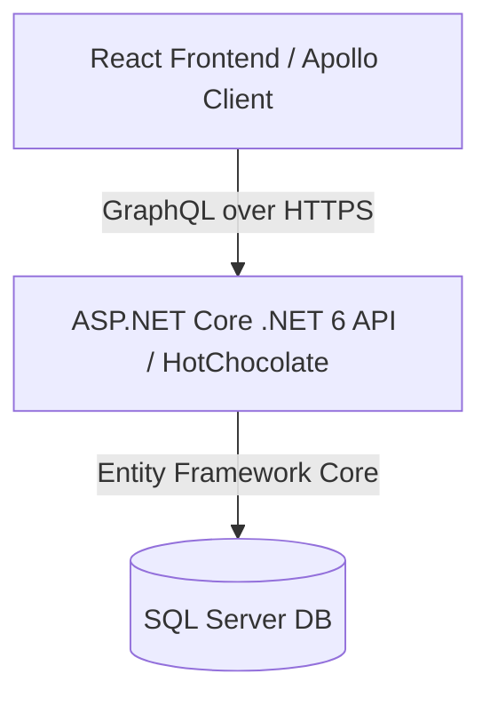

# System Architecture & Core Standards: OneITB23

**Environment**: Production & Local Development
**Constitution Version**: 1.0.0

## 1. Stack & Architecture Overview
OneITB23 is structured as a decoupled Client-Server architecture. The backend API and the frontend web client communicate strictly and exclusively through the GraphQL endpoint:

### Domain Separation
- **Frontend SPA**: React (v18.2.0), Vite (v4.2.0), React Router DOM (v6.10.0), and Apollo Client (`@apollo/client` v3.7.12).
- **Backend API**: .NET 6 (ASP.NET Core), HotChocolate GraphQL engine, Entity Framework Core.
- **Relational Storage**: SQL Server.

## 2. Infrastructure Requirements
- **Local Connection String**: Development DB configurations must use `TrustServerCertificate=True` in `appsettings.Development.json` to allow secure local SSL connections.
- **EF Migrations**: Code-First migrations must be targeted to the appropriate data assemblies using:
  `dotnet ef database update --project "API Graphql/Data/Data.csproj" --startup-project "API Graphql/OneITB/GraphQL.csproj"`
