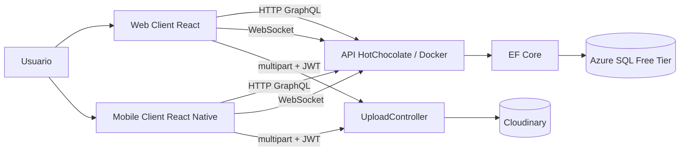
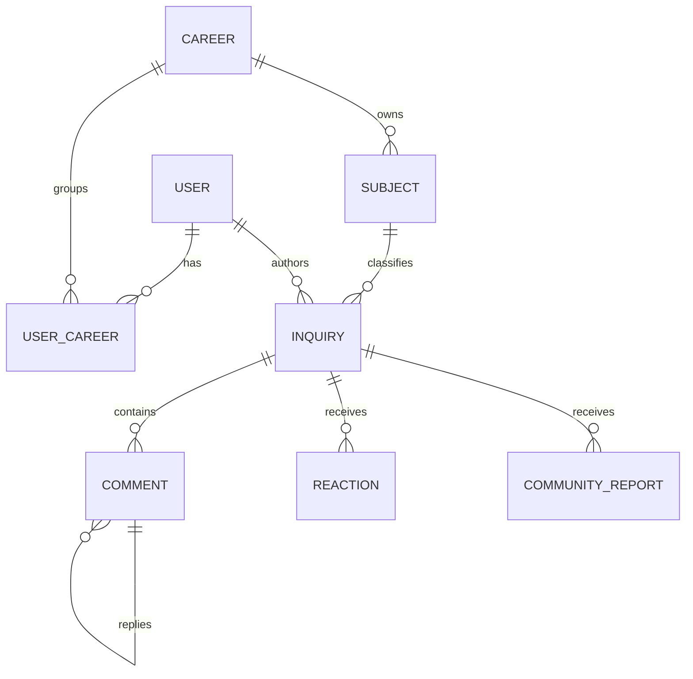
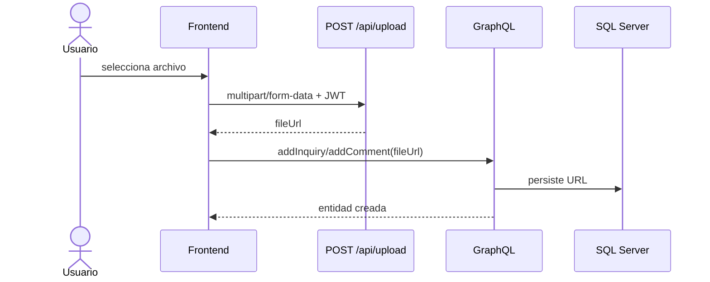
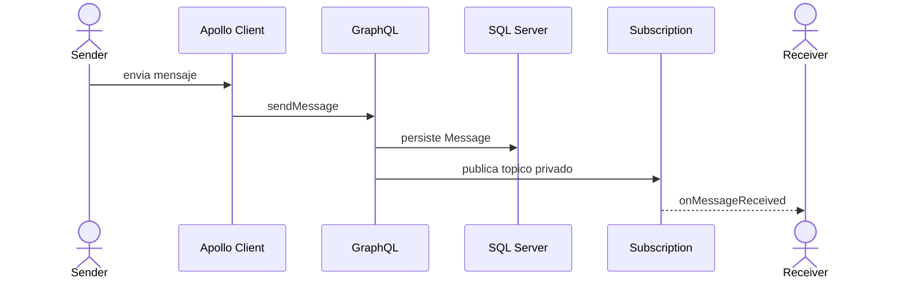

# 4. Diagramas de diseno

La explicacion tecnica completa se mantiene en [architecture-and-design.md](../project_docs/architecture-and-design.md).

## 4.1 Contexto

## 4.2 Dominio social y academico

## 4.3 Carga desacoplada

## 4.4 Mensaje en tiempo real

