# 4. Diagramas de diseño

| Dato de control | Valor |
|---|---|
| **Sistema** | OneITB23 |
| **Versión documental** | 2.0 |
| **Fecha de revisión** | 3 de agosto de 2026 |
| **Clasificación** | Vistas arquitectónicas derivadas |
| **Notación** | Mermaid; DER con cardinalidad Crow's Foot |
| **Fuente normativa** | [`architecture-and-design.md`](../project_docs/architecture-and-design.md) y modelo EF Core |

Los diagramas resumen el corte arquitectónico actual y están preparados para exportarse
con tema claro. No reemplazan el modelo EF Core, las migraciones ni los contratos
ejecutados. Los diagramas de flujo fuerzan líneas rectas u ortogonales para mejorar su
lectura impresa; los DER se dividen por subdominio para evitar una única lámina ilegible.

---

## 4.1 Índice y estrategia de exportación

| Figura | Vista | Uso recomendado |
|---:|---|---|
| 1 | Contexto del sistema | Presentación y memoria técnica |
| 2 | Componentes lógicos | Explicación arquitectónica |
| 3 | DER de identidad, perfil y catálogo | Anexo de datos |
| 4 | DER social, mensajería y moderación | Anexo de datos |
| 5 | DER académico, empleabilidad y auditoría | Anexo de datos |
| 6 | Autenticación Microsoft Entra | Seguridad e identidad |
| 7 | Publicación multimedia desacoplada | Contrato REST + GraphQL |
| 8 | Sincronización SIU mock | Patrón Adapter |
| 9 | Onboarding empresarial | B2B, transacción y Outbox |
| 10 | Notificaciones Pub/Sub | Tiempo real y escalabilidad |
| 11 | Despliegue local/aceptación | Reproducibilidad de demo |
| 12 | Plantilla productiva | Evolución cloud |
| 13 | Rebaseline de base demo | Operación y recuperación |

Para la entrega se recomienda exportar las figuras 1, 2, 6, 9, 10, 11 y 12 como SVG. Los
tres DER deben recrearse o ajustarse en diagrams.net si la exportación Mermaid no permite
controlar el enrutamiento Crow's Foot y el tamaño tipográfico requerido por la impresión.

## 4.2 Figura 1 - Contexto del sistema

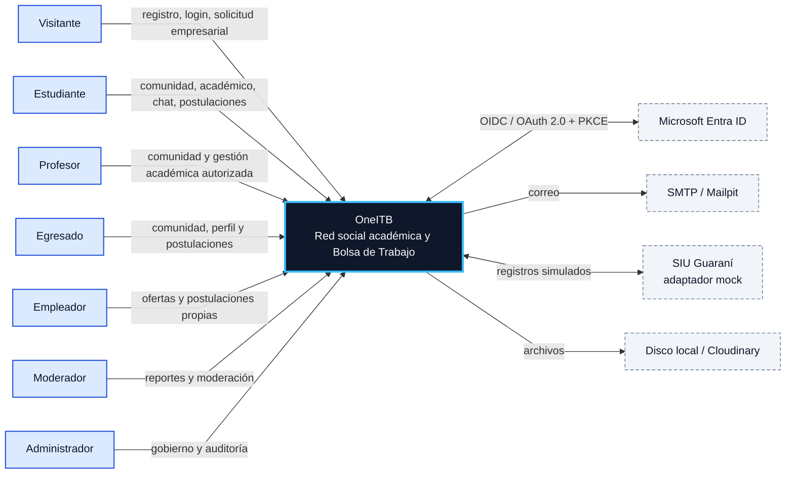

**Lectura.** OneITB constituye la frontera central. Los siete actores interactúan con
capacidades diferentes y toda autorización se resuelve dentro de la API. Entra, correo,
SIU y almacenamiento son sistemas externos o adaptadores; el gráfico no implica que sus
proveedores productivos estén aceptados.

## 4.3 Figura 2 - Componentes lógicos

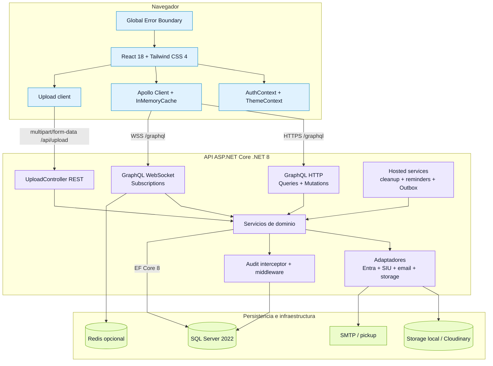

**Lectura.** GraphQL transporta negocio; `POST /api/upload` es la excepción binaria
autenticada. Apollo separa HTTP y WebSocket. Los servicios de dominio concentran
autorización y reglas, mientras EF Core persiste y el interceptor registra cambios
críticos. Redis, Cloudinary y SMTP se seleccionan por ambiente.

## 4.4 Modelo de dominio relacional

El `OneItbContext` vigente expone **30 conjuntos persistidos**. Para preservar legibilidad
se presentan tres vistas complementarias. Una entidad puede repetirse como referencia
entre vistas, pero el inventario lógico se cuenta una sola vez.

### Figura 3 - DER de identidad, perfil y catálogo académico

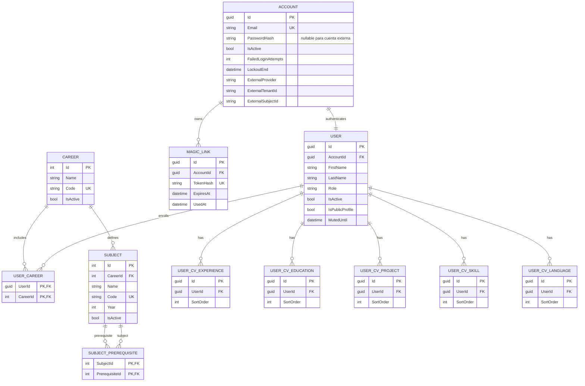

**Reglas destacadas.** `Account`-`User` es uno a uno. La identidad Microsoft se almacena
en campos únicos del agregado `Account`, no en una tabla paralela. `UserCareer` y
`SubjectPrerequisite` poseen claves compuestas. Las secciones del CV son entidades
normalizadas y ordenables; no se persisten como JSON o LocalStorage.

### Figura 4 - DER social, mensajería y moderación

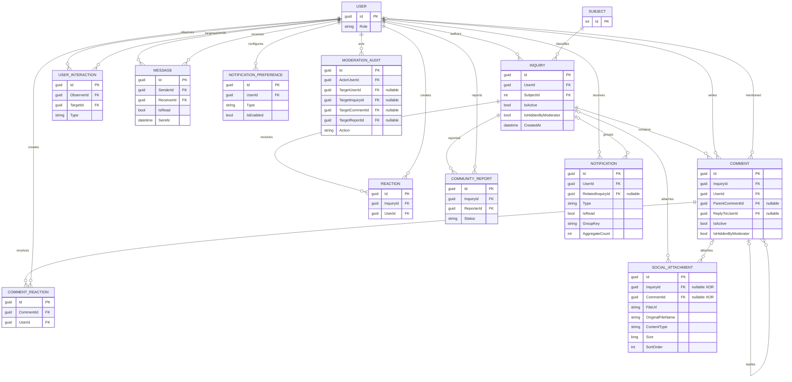

**Reglas destacadas.** Inquiry y Comment utilizan soft delete y ocultamiento moderado
separados. Reacciones son únicas por usuario/contenido. `SocialAttachment` exige XOR:
pertenece a una Inquiry o a un Comment, nunca a ambos ni a ninguno. El nivel lógico de
respuestas se limita a dos aunque la FK sea autorreferencial. Mensajes tienen dos FKs
restrictivas a User y las notificaciones se agrupan sin contar historial leído.

### Figura 5 - DER académico, empleabilidad, onboarding y auditoría

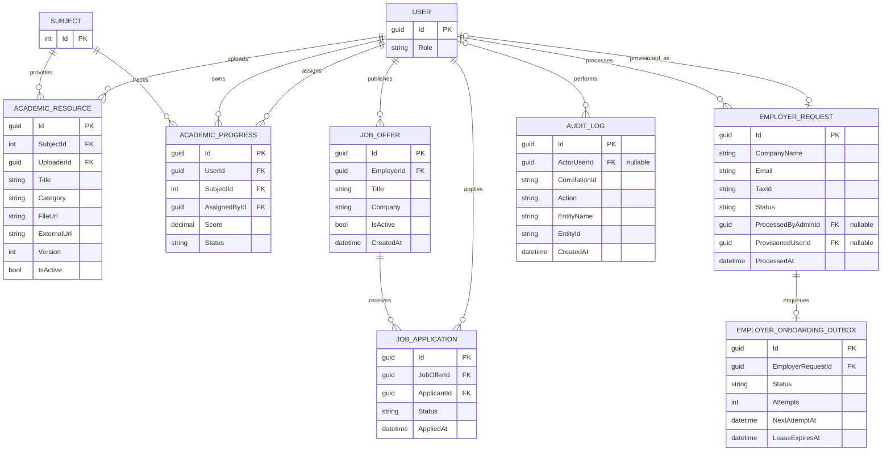

**Reglas destacadas.** `AcademicProgress` es único por estudiante/materia y conserva al
asignador. `JobApplication` es única por oferta/postulante. La aprobación empresarial
vincula opcionalmente procesador y usuario aprovisionado; el Outbox desacopla correo de la
transacción. `AuditLog` acepta actor nulo para procesos técnicos, pero nunca secretos.

## 4.5 Secuencias críticas

### Figura 6 - Autenticación Microsoft Entra por redirect

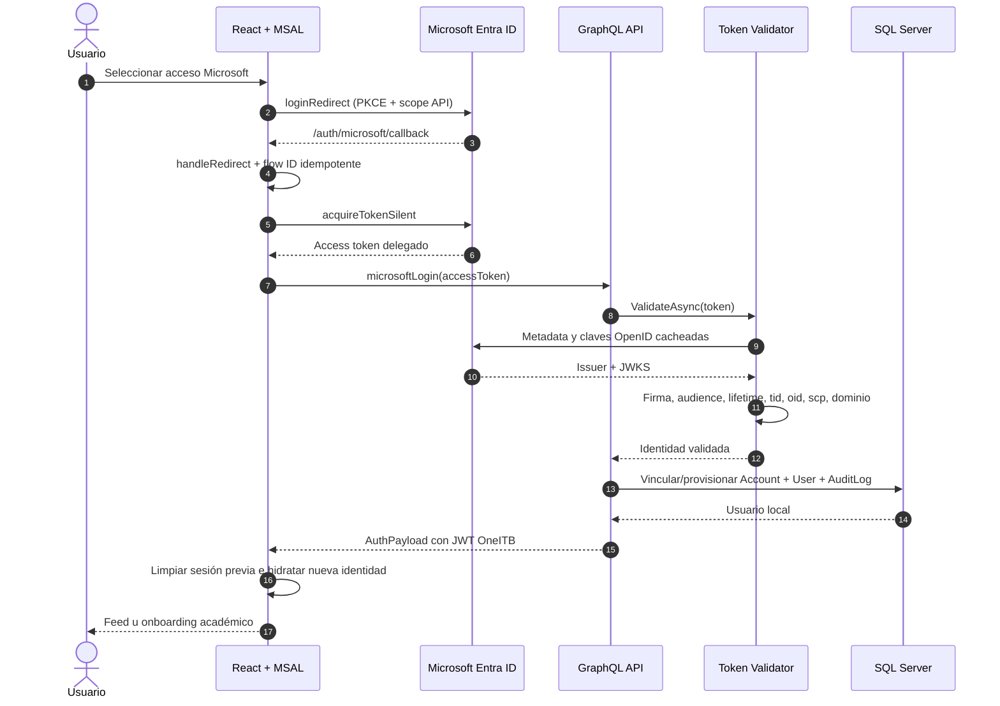

**Seguridad.** La autoridad `common` admite directorios organizacionales, pero la API
valida el tenant concreto del token. El access token externo no sustituye el JWT local.
Múltiples cuentas ambiguas o configuración incompleta fallan de forma cerrada.

### Figura 7 - Publicación multimedia con carga desacoplada

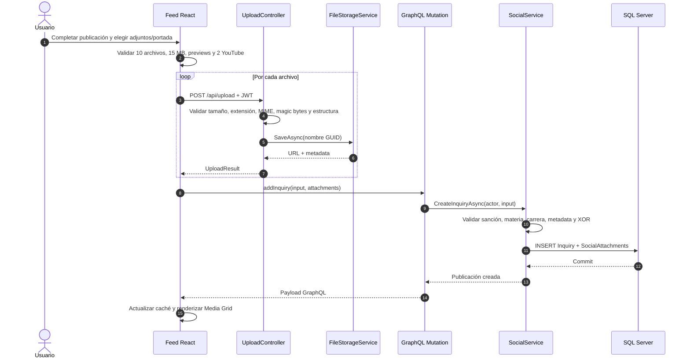

**Frontera.** El upload físico no crea por sí solo una publicación. Los archivos quedan
referenciados recién al completar GraphQL; un worker limpia uploads huérfanos. La entrega
estática por recurso permanece como `GAP-FILE-01`.

### Figura 8 - Sincronización académica mediante SIU mock

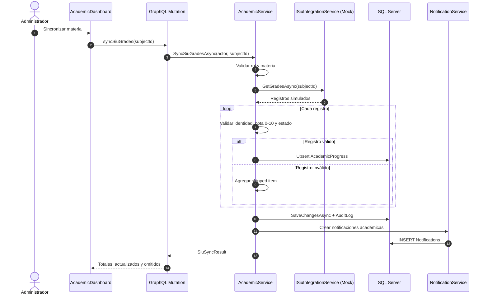

**Límite.** El adaptador demuestra desacoplamiento y upsert; no representa una conexión
real ni procesa información del SIU institucional.

### Figura 9 - Solicitud, aprobación y bienvenida de empleador

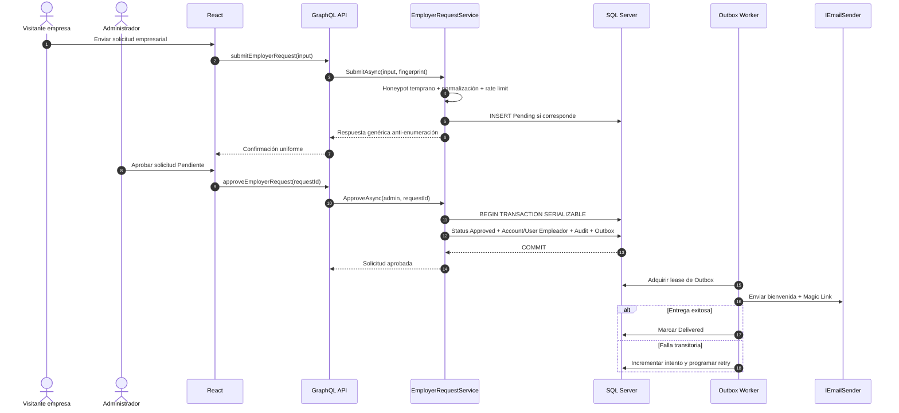

**Seguridad y consistencia.** El rol aprovisionado es siempre Empleador. La transacción
evita estados parciales y el Outbox impide que una falla SMTP deshaga la cuenta o genere
duplicados. El rechazo registra acción sin copiar el motivo sensible al audit transversal.

## 4.6 Figura 10 - Notificaciones y mensajes en tiempo real

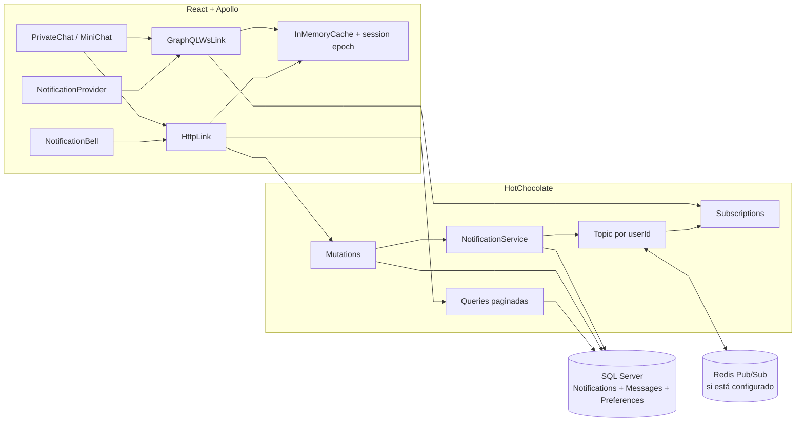

**Lectura.** El evento realtime no reemplaza la persistencia. Queries recuperan estado y
badges desde registros no leídos; subscriptions aceleran la UI. Los topics se derivan de
la identidad autenticada. En memoria sirve una instancia; Redis permite distribución
entre réplicas. Logout cierra el socket y descarta respuestas de una época anterior.

## 4.7 Despliegue y operación

### Figura 11 - Entorno local y de aceptación

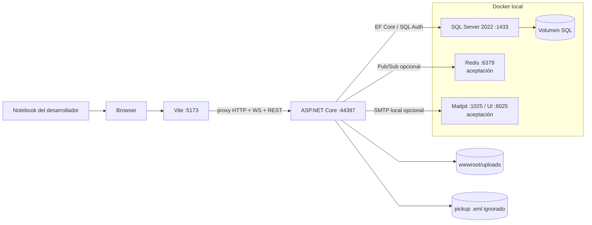

**Lectura.** SQL Server Docker es la base local canónica. Redis y Mailpit se agregan en
aceptación sin reemplazar SQL. Vite conserva origen simple mediante proxy. Secretos y
archivos generados permanecen fuera de Git.

### Figura 12 - Plantilla de despliegue productivo

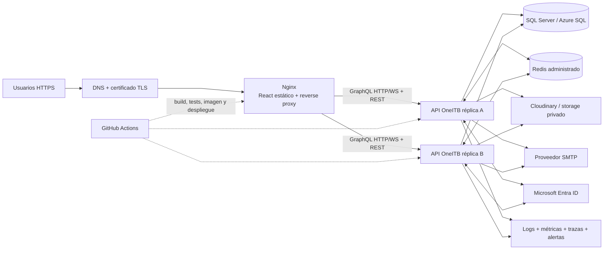

**Límite de esta vista.** Es una arquitectura objetivo soportada por adaptadores y
contenedores, no un ambiente productivo aceptado. El destino requiere certificado SQL
verificable (`TrustServerCertificate=False`), storage compartido/privado, Redis y SMTP
reales, observabilidad, backup/restore, rotación y respuesta a incidentes.

### Figura 13 - Rebaseline y aceptación de la base demo

```mermaid
%%{init: {"theme": "default", "flowchart": {"curve": "linear"}}}%%
flowchart LR
    GUARD["Validar contenedor, puerto, DB y secretos"] --> BUILD["Build Release + EF sin drift"]
    BUILD --> BACKUP["BACKUP COPY_ONLY + CHECKSUM"]
    BACKUP --> VERIFY["RESTORE VERIFYONLY"]
    VERIFY --> DROP["Eliminar solo OneItb"]
    DROP --> MIGRATE["Aplicar migraciones EF Core"]
    MIGRATE --> SEED1["Seed canónico por fases"]
    SEED1 --> CLEAR1["SaveChanges + ChangeTracker.Clear"]
    CLEAR1 --> SNAP1["Inventario 1"]
    SNAP1 --> SEED2["Segunda ejecución idempotente"]
    SEED2 --> SNAP2["Inventario 2"]
    SNAP2 --> SAME{"Inventarios idénticos"}
    SAME -->|"No"| RESTORE["Abortar y restaurar backup"]
    SAME -->|"Sí"| INTEGRITY["Integridad relacional = 0"]
    INTEGRITY --> ROLES["Login de 6 roles"]
    ROLES --> SMOKE["Smoke GraphQL + upload"]
    SMOKE --> DONE["Base demo aceptada"]
```

**Seguridad operativa.** El procedimiento se limita al contenedor y base canónicos,
requiere confirmación destructiva y conserva backup fuera de Git. Las migraciones crean
el esquema; el seeder aporta únicamente datos y debe producir el mismo inventario en una
segunda ejecución.

## 4.8 Reglas de consistencia y mantenimiento

1. Un cambio de entidad o FK obliga a actualizar las figuras 3, 4 o 5 después de aplicar
   la migración correspondiente.
2. Un cambio de transporte, provider o middleware obliga a revisar figuras 1, 2, 10, 11
   y 12.
3. Los diagramas de secuencia deben usar nombres reales de contratos y no convertir una
   intención futura en comportamiento vigente.
4. Las líneas de asociación en DER indican cardinalidad, no orden de ejecución.
5. Los componentes externos con aceptación pendiente deben conservar estilo diferenciado
   o una nota de límite.
6. Ningún diagrama debe incluir passwords, tokens, connection strings, CUIT reales o PII.
7. Antes de imprimir, cada SVG debe comprobarse al 100 % de zoom y en escala de grises.
8. La memoria final puede reutilizar estas vistas, pero debe numerarlas como figuras y
   mantener título, fuente y descripción accesible.

## 4.9 Correspondencia con fuentes

| Vista | Fuentes de contraste |
|---|---|
| Contexto y componentes | `Startup.cs`, frontend providers, arquitectura secciones 2-5 |
| DER | `OneItbContext.cs`, 30 `DbSet`, modelos y migraciones vigentes |
| Entra | `MicrosoftEntraOptions`, validator, auth service y callback React |
| Multimedia | `UploadController`, storage service, social service y Media Grid |
| SIU | `ISiuIntegrationService`, mock y `AcademicService` |
| B2B | `EmployerRequestService`, entidades de request/Outbox y worker |
| Pub/Sub | configuración HotChocolate, `NotificationService`, Apollo WS y Redis |
| Despliegue | Dockerfiles, Compose local/acceptance/productivo, Nginx y Runbook |
| Rebaseline | script de rebaseline, seeder, migraciones y evidencia de Spec 196 |

La fuente de verdad continúa siendo el código ejecutado. Si una figura contradice una
migración o un contrato runtime, debe corregirse la figura y registrar la desviación; no
se modifica el sistema para hacerlo coincidir con una representación desactualizada.
