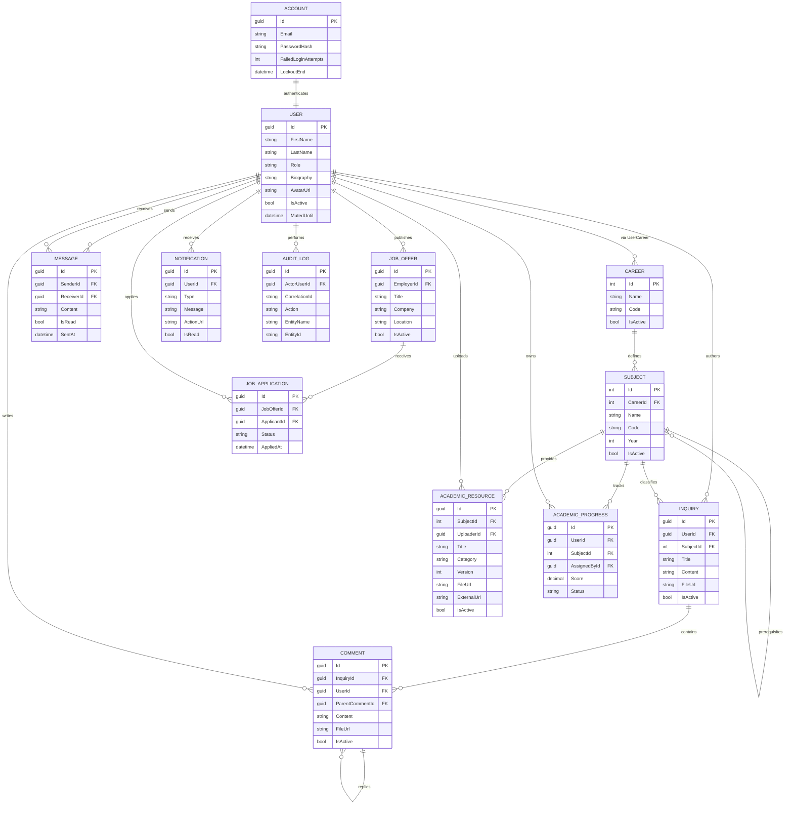
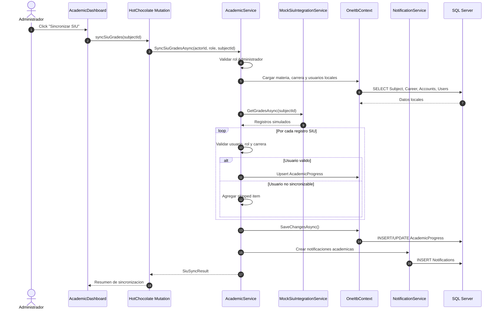
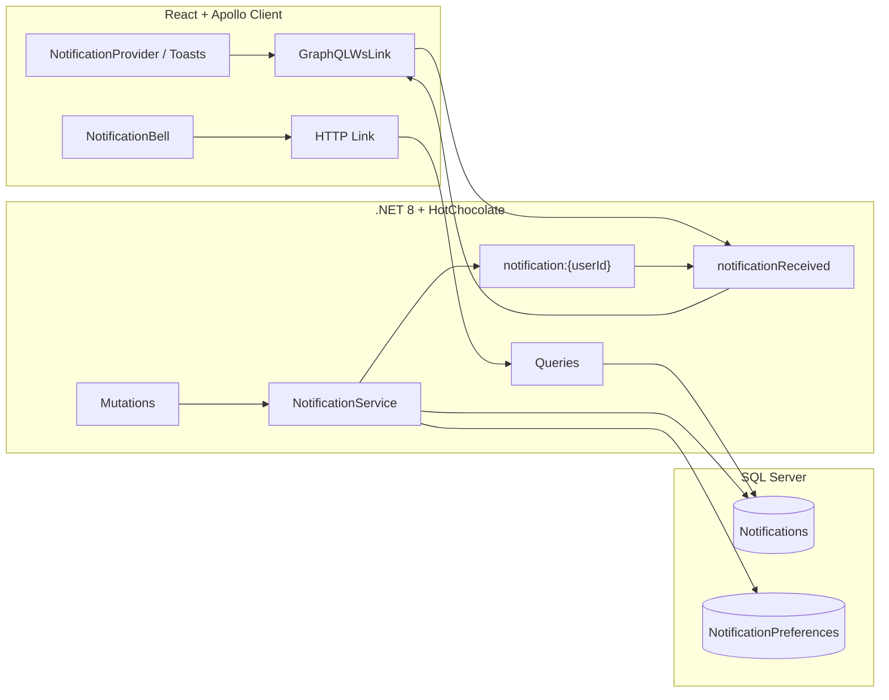
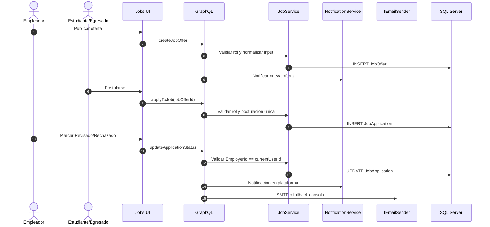
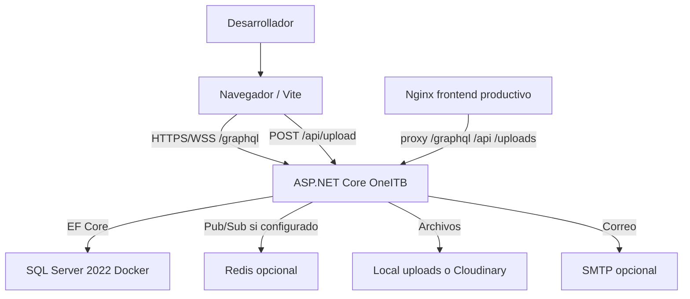

# 4. Diagramas de diseno

Este documento resume la arquitectura vigente de OneITB23 con diagramas Mermaid renderizables. La explicacion narrativa completa se mantiene en [architecture-and-design.md](../project_docs/architecture-and-design.md).

## 4.1 Diagrama ER resumido

## 4.2 Secuencia de sincronizacion SIU Guarani

## 4.3 Arquitectura Pub/Sub de notificaciones

## 4.4 Flujo de empleos, postulaciones y correo

## 4.5 Contexto de despliegue local y productivo

