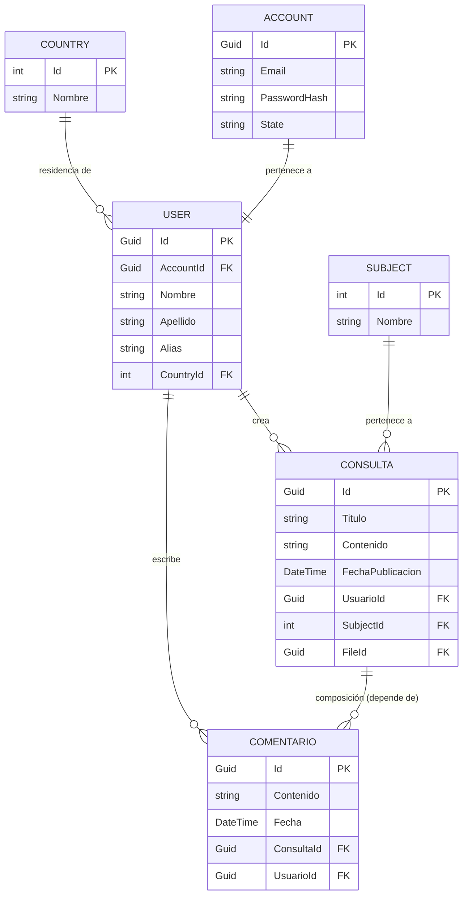
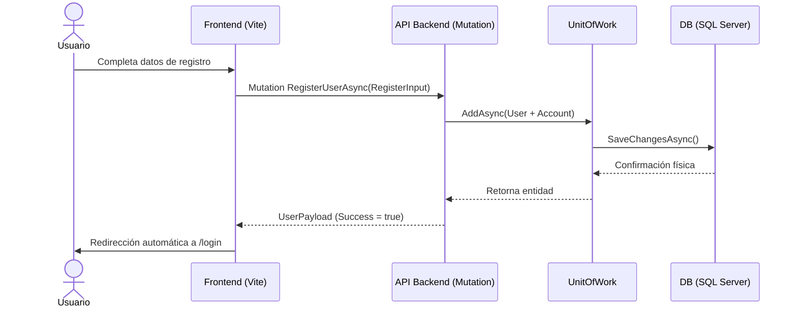
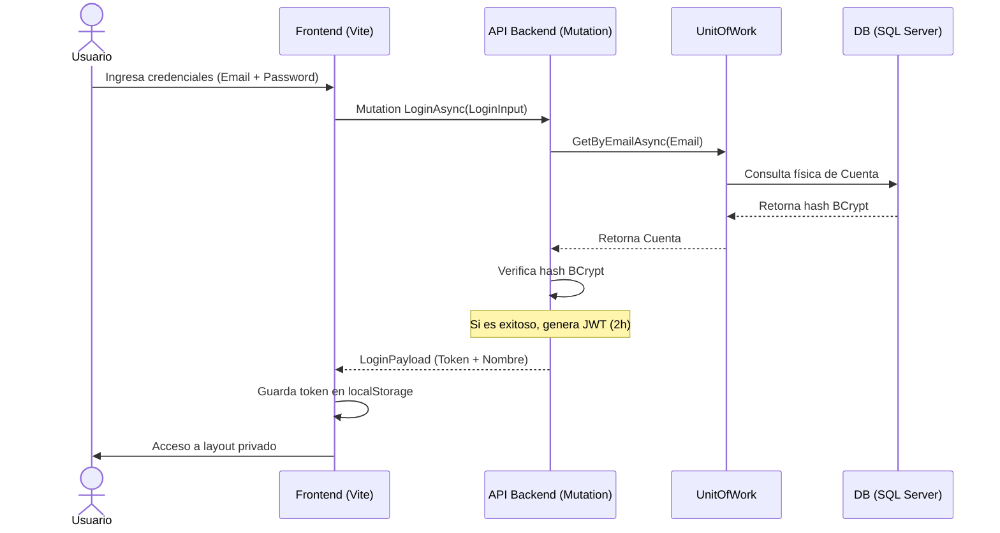
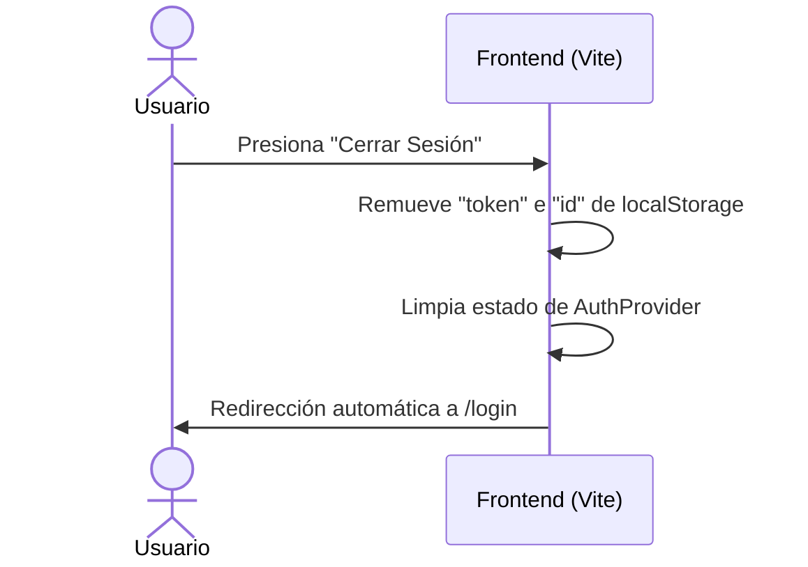
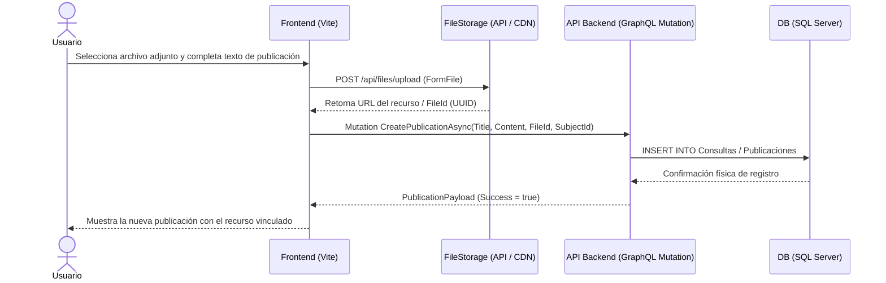
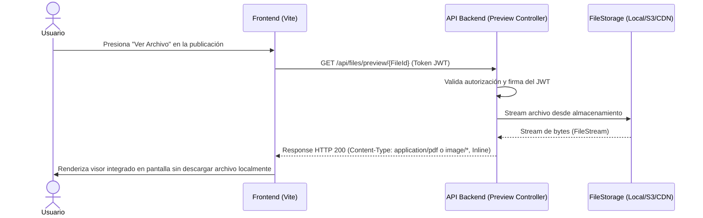

# 4. Diagramas de Diseño, Flujo y Persistencia

## 4.1. Diagrama Entidad-Relación (DER) Normalizado

---

## 4.2. Diagramas de Secuencia Corregidos

### 4.2.1. Registro de Usuario ➡️ Login

### 4.2.2. Flujo de Inicio de Sesión (Login)

### 4.2.3. Flujo de Cierre de Sesión (Logout)

### 4.2.4. Creación de Publicación con Carga Desacoplada

### 4.2.5. Flujo de Vista Previa de Archivo (Preview Endpoint)

