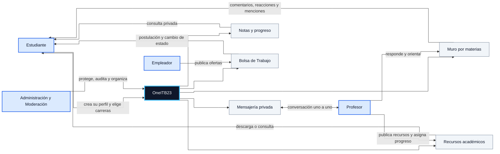
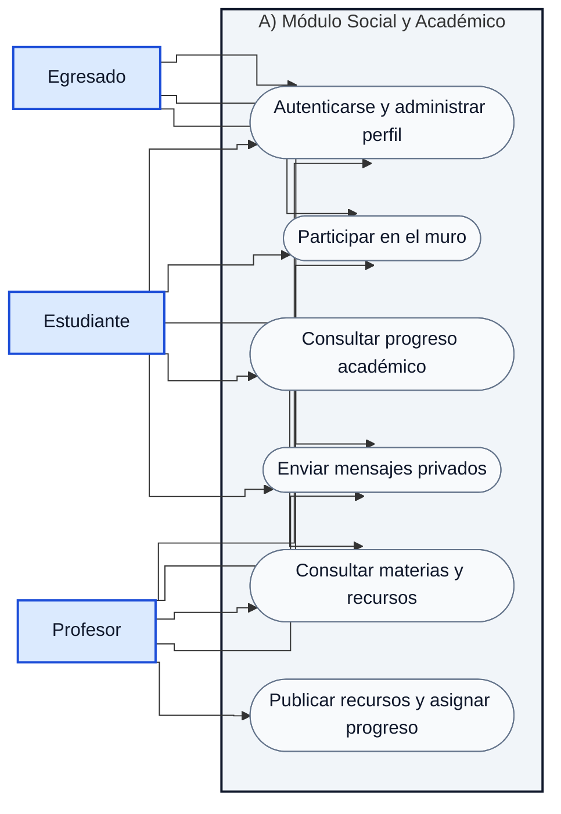
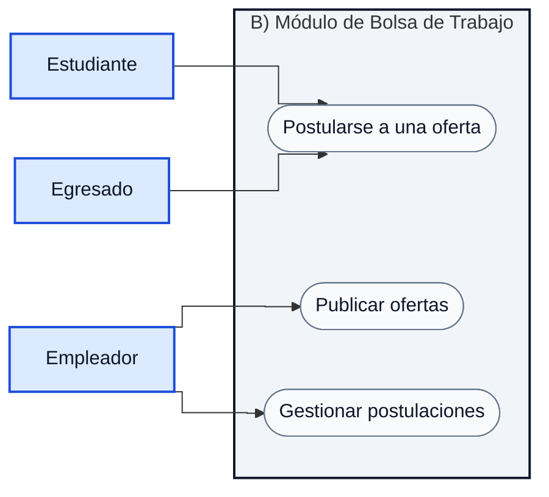
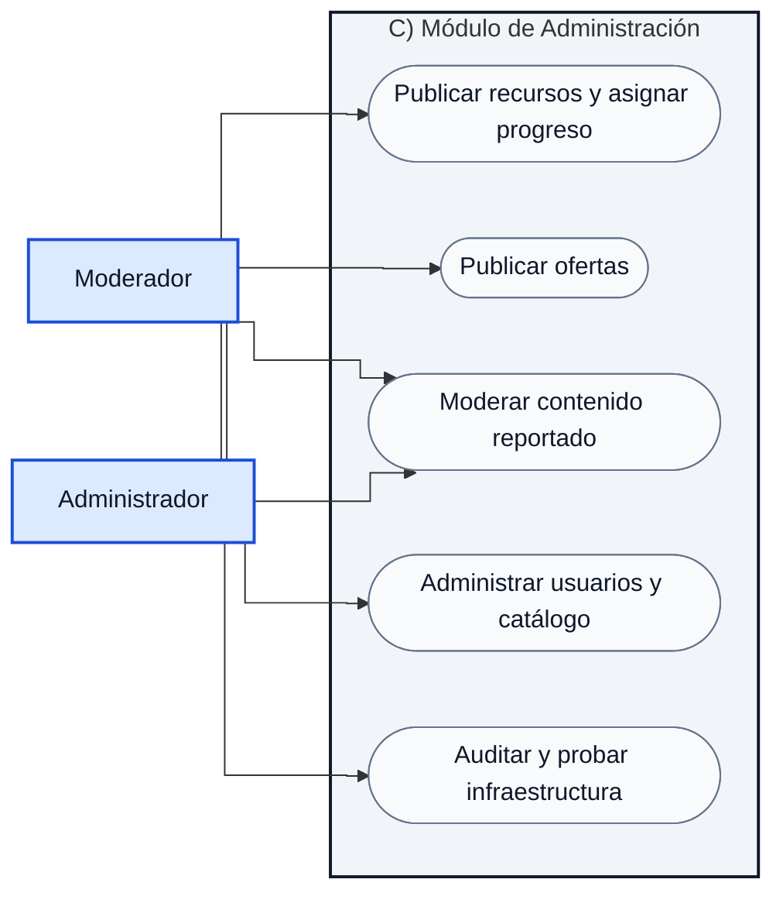
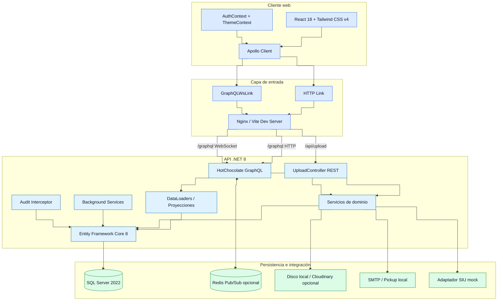
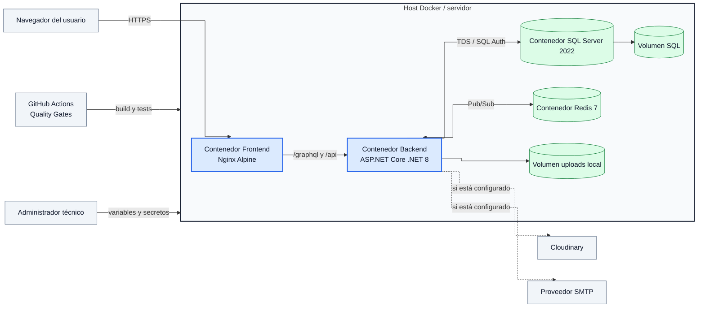
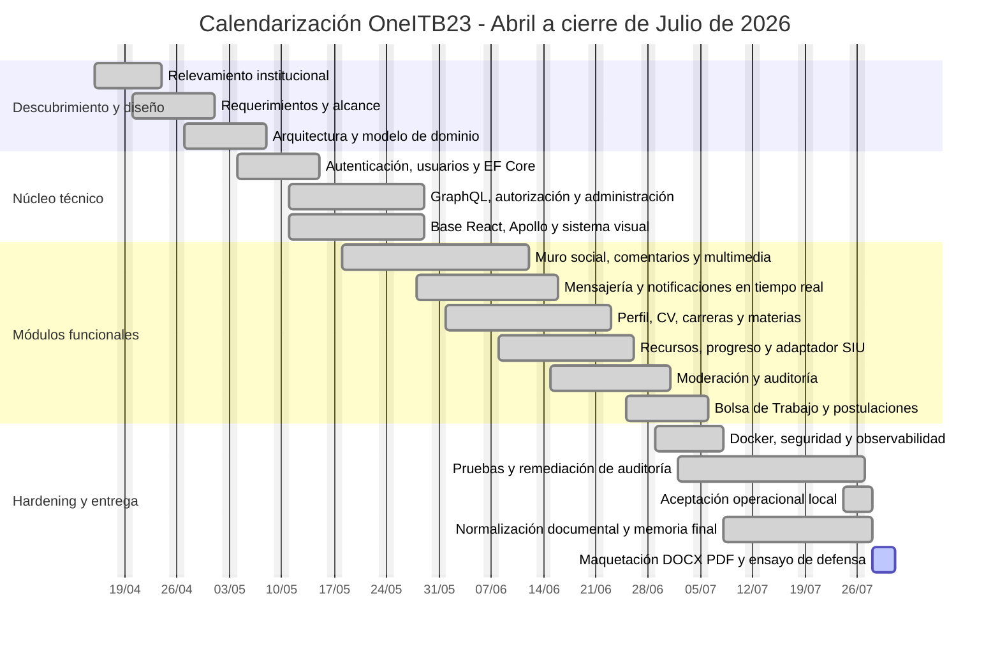

```mermaid
erDiagram
    USER {
        uuid Id PK
        string FirstName
        string LastName
        string Role
        string Biography
        string Phone
        string AvatarUrl
        bool IsActive
        bool IsPublicProfile
        datetime MutedUntil
    }
    ACCOUNT {
        uuid Id PK
        string Email UK
        string PasswordHash "nullable for external-only"
        string ExternalProvider
        string ExternalTenantId
        string ExternalSubjectId
        datetime LastExternalLoginAt
        int FailedLoginAttempts
        datetime LockoutEnd
        datetime CreatedAt
    }
    MAGIC_LINK {
        uuid Id PK
        uuid AccountId FK
        string Token
        datetime ExpiresAt
        bool IsUsed
    }
    EMPLOYER_REQUEST {
        uuid Id PK
        string CompanyName
        string ContactName
        string Email
        string Phone
        string TaxId
        string Status
        datetime CreatedAt
        datetime ProcessedAt
        uuid ProcessedByAdminId FK
        uuid ProvisionedUserId FK
        string EmailDeliveryStatus
    }
    EMPLOYER_ONBOARDING_OUTBOX {
        uuid Id PK
        uuid EmployerRequestId FK,UK
        string Status
        datetime NextAttemptAt
        datetime LeaseExpiresAt
        datetime ProcessedAt
        int Attempts
        string LastErrorCode
    }
    CAREER {
        int Id PK
        string Name
        string Code
        bool IsActive
    }
    USER_CAREER {
        uuid UserId PK,FK
        int CareerId PK,FK
    }
    SUBJECT {
        int Id PK
        int CareerId FK
        string Name
        string Code
        int Year
        bool IsActive
    }
    SUBJECT_PREREQUISITE {
        int SubjectId PK,FK
        int PrerequisiteId PK,FK
    }
    INQUIRY {
        uuid Id PK
        uuid UserId FK
        int SubjectId FK
        string Title
        string Content
        bool IsActive
        bool IsHiddenByModerator
        bool PreferAttachmentCover
        datetime CreatedAt
    }
    COMMENT {
        uuid Id PK
        uuid InquiryId FK
        uuid UserId FK
        uuid ParentCommentId FK
        uuid ReplyToUserId FK
        string Content
        bool IsActive
        bool IsHiddenByModerator
        datetime CreatedAt
    }
    SOCIAL_ATTACHMENT {
        uuid Id PK
        uuid InquiryId FK
        uuid CommentId FK
        string FileUrl
        string OriginalFileName
        string ContentType
        long Size
        int SortOrder
    }
    REACTION {
        uuid Id PK
        uuid InquiryId FK
        uuid UserId FK
    }
    COMMENT_REACTION {
        uuid Id PK
        uuid CommentId FK
        uuid UserId FK
    }
    COMMUNITY_REPORT {
        uuid Id PK
        uuid InquiryId FK
        uuid ReporterId FK
        string Reason
        string Status
        datetime CreatedAt
    }
    USER_INTERACTION {
        uuid Id PK
        uuid ObserverId FK
        uuid TargetId FK
        string Type
        datetime CreatedAt
    }
    MESSAGE {
        uuid Id PK
        uuid SenderId FK
        uuid ReceiverId FK
        string Content
        datetime SentAt
        bool IsRead
    }
    NOTIFICATION {
        uuid Id PK
        uuid UserId FK
        string Type
        string Message
        string ActionUrl
        bool IsRead
        string GroupKey
        int AggregateCount
        datetime CreatedAt
    }
    NOTIFICATION_PREFERENCE {
        uuid Id PK
        uuid UserId FK
        string Type
        bool IsEnabled
        datetime UpdatedAt
    }
    ACADEMIC_RESOURCE {
        uuid Id PK
        int SubjectId FK
        uuid UploaderId FK
        string Title
        string FileUrl
        string ExternalUrl
        string Category
        int Version
        bool IsActive
    }
    ACADEMIC_PROGRESS {
        uuid Id PK
        uuid UserId FK
        int SubjectId FK
        uuid AssignedById FK
        decimal Score
        string Status
        string Notes
        datetime UpdatedAt
    }
    JOB_OFFER {
        uuid Id PK
        uuid EmployerId FK
        string Title
        string Company
        string Location
        bool IsActive
        datetime CreatedAt
    }
    JOB_APPLICATION {
        uuid Id PK
        uuid JobOfferId FK
        uuid ApplicantId FK
        string Status
        datetime AppliedAt
    }
    CV_EXPERIENCE {
        uuid Id PK
        uuid UserId FK
        string Company
        string Role
        bool IsHidden
        int SortOrder
    }
    CV_EDUCATION {
        uuid Id PK
        uuid UserId FK
        string Institution
        string Degree
        bool IsHidden
        int SortOrder
    }
    CV_PROJECT {
        uuid Id PK
        uuid UserId FK
        string Name
        string Role
        string Url
        bool IsHidden
    }
    CV_SKILL {
        uuid Id PK
        uuid UserId FK
        string Name
        string Level
        bool IsHidden
    }
    CV_LANGUAGE {
        uuid Id PK
        uuid UserId FK
        string Name
        string Level
        bool IsHidden
    }
    AUDIT_LOG {
        uuid Id PK
        uuid ActorUserId FK
        string CorrelationId
        string Action
        string EntityName
        string EntityId
        string OldValuesJson
        string NewValuesJson
        datetime CreatedAt
    }
    MODERATION_AUDIT {
        uuid Id PK
        uuid ActorUserId FK
        uuid TargetUserId FK
        uuid TargetInquiryId FK
        uuid TargetCommentId FK
        uuid TargetReportId FK
        string Action
        string Summary
        datetime CreatedAt
    }

    USER ||--|| ACCOUNT : owns
    ACCOUNT ||--o{ MAGIC_LINK : issues
    USER o|--o{ EMPLOYER_REQUEST : processes
    USER o|--o| EMPLOYER_REQUEST : provisioned_as
    EMPLOYER_REQUEST ||--o| EMPLOYER_ONBOARDING_OUTBOX : enqueues
    USER ||--o{ USER_CAREER : enrolls
    CAREER ||--o{ USER_CAREER : includes
    CAREER ||--o{ SUBJECT : contains
    SUBJECT ||--o{ SUBJECT_PREREQUISITE : requires
    SUBJECT ||--o{ SUBJECT_PREREQUISITE : prerequisite_for
    USER ||--o{ INQUIRY : authors
    SUBJECT ||--o{ INQUIRY : classifies
    INQUIRY ||--o{ COMMENT : receives
    USER ||--o{ COMMENT : writes
    COMMENT o|--o{ COMMENT : replies
    INQUIRY o|--o{ SOCIAL_ATTACHMENT : has
    COMMENT o|--o{ SOCIAL_ATTACHMENT : has
    INQUIRY ||--o{ REACTION : receives
    USER ||--o{ REACTION : makes
    COMMENT ||--o{ COMMENT_REACTION : receives
    USER ||--o{ COMMENT_REACTION : makes
    INQUIRY ||--o{ COMMUNITY_REPORT : receives
    USER ||--o{ COMMUNITY_REPORT : files
    USER ||--o{ USER_INTERACTION : observes
    USER ||--o{ USER_INTERACTION : targeted_by
    USER ||--o{ MESSAGE : sends
    USER ||--o{ MESSAGE : receives
    USER ||--o{ NOTIFICATION : receives
    USER ||--o{ NOTIFICATION_PREFERENCE : configures
    SUBJECT ||--o{ ACADEMIC_RESOURCE : groups
    USER ||--o{ ACADEMIC_RESOURCE : uploads
    USER ||--o{ ACADEMIC_PROGRESS : owns
    SUBJECT ||--o{ ACADEMIC_PROGRESS : evaluates
    USER ||--o{ ACADEMIC_PROGRESS : assigns
    USER ||--o{ JOB_OFFER : publishes
    JOB_OFFER ||--o{ JOB_APPLICATION : receives
    USER ||--o{ JOB_APPLICATION : submits
    USER ||--o{ CV_EXPERIENCE : records
    USER ||--o{ CV_EDUCATION : records
    USER ||--o{ CV_PROJECT : records
    USER ||--o{ CV_SKILL : records
    USER ||--o{ CV_LANGUAGE : records
    USER o|--o{ AUDIT_LOG : acts
    USER ||--o{ MODERATION_AUDIT : performs
```

# DOCUMENTO BASE DE PRÁCTICA PROFESIONALIZANTE III

**Proyecto:** OneITB23 - Red Social Académica y Bolsa de Trabajo Institucional<br>
**Institución:** Instituto Tecnológico Beltrán<br>
**Carrera:** Tecnicatura Superior en Análisis de Sistemas<br>
**Espacio curricular:** Práctica Profesionalizante III<br>
**Alumno/a:** [Completar nombre y apellido]<br>
**Docente/s:** [Completar]<br>
**Ciclo lectivo:** 2026<br>
**Versión del documento:** 1.7 - Microsoft Entra y onboarding B2B de empleadores<br>
**Fecha de corte técnico-documental:** 30 de julio de 2026

> **Alcance de esta memoria.** Este documento describe el estado comprobable del repositorio OneITB23 al momento de su redacción. Distingue entre funcionalidades implementadas, validaciones automatizadas y verificaciones externas todavía pendientes. Los nombres y versiones se corresponden con el código fuente: .NET 8 (Microsoft, 2023a), Entity Framework Core 8.0.6 (Microsoft, 2023b), Hot Chocolate 14.2.0 (ChilliCream, s. f.), GraphQL (GraphQL Foundation, 2021), React 18 (React Team, 2022), Apollo Client 3.7 (Apollo GraphQL, s. f.), Vite 8 (Vite Team, 2026), Tailwind CSS 4 (Wathan, 2025) y SQL Server 2022 (Microsoft, 2025).

**Resumen ejecutivo**

OneITB23 es una plataforma web institucional que integra comunicación académica, identidad profesional, recursos por materia, mensajería privada, seguimiento del progreso, moderación y empleabilidad. El sistema centraliza actividades que, de otro modo, quedarían fragmentadas entre redes sociales generalistas, correo, mensajería informal y repositorios de archivos sin contexto académico.

La solución adopta una arquitectura desacoplada: una aplicación de página única o SPA (Mozilla, 2025) consume una API GraphQL desarrollada en .NET 8; Entity Framework Core administra la persistencia en SQL Server; las operaciones en tiempo real utilizan el protocolo WebSocket (Fette & Melnikov, 2011); y la carga binaria se resuelve mediante un endpoint basado en el estilo arquitectónico REST (Fielding, 2000). El despliegue productivo se modela con contenedores Docker (Docker, Inc., s. f.) para NGINX (NGINX, Inc., s. f.), la API, SQL Server y Redis (Redis Ltd., s. f.), con adaptadores opcionales para el protocolo SMTP (Klensin, 2008) y almacenamiento Cloudinary (Cloudinary, 2026). Cuando esas variables externas no existen, el entorno local mantiene mecanismos alternativos seguros y reproducibles.

El núcleo funcional se encuentra implementado y el roadmap registra un 100 % global (117 de 117 ítems), con el core funcional completo. La evidencia automatizada más reciente registra 183 pruebas backend y 85 pruebas frontend aprobadas, compilaciones Release/Vite sin errores y esquema de Entity Framework sin cambios pendientes. La base de demostración fue respaldada y reconstruida desde las migraciones canónicas; las migraciones posteriores incorporaron identidad externa Microsoft Entra y onboarding B2B sin alterar el grafo demo. Dos ejecuciones del seeder produjeron un inventario idéntico, la auditoría relacional obtuvo cero violaciones y seis identidades canónicas autenticaron con el rol esperado. La aceptación local también verificó aislamiento de sesión, Redis entre proveedores Hot Chocolate independientes y entrega SMTP capturada mediante Mailpit/pickup local. El acceso institucional Microsoft 365 se implementó con MSAL Authorization Code + PKCE y validación backend del access token (Microsoft, s. f.); el consentimiento y smoke contra el tenant real permanecen como gate externo. El alta empresarial controlada se verificó desde la solicitud GraphQL hasta la aprobación, el Outbox y el correo `.eml`; su recorrido visual público/Admin queda pendiente. También restan como controles de cierre académico la regresión visual manual del rol Moderador, la prueba WebSocket de red con dos sesiones aisladas y la maquetación final.

**Índice**

1. Presentación general del proyecto
2. Especificación de requerimientos de software
3. Diseño del sistema
4. Arquitectura
5. Gestión y pruebas
6. Manual de usuario
7. Anexos
8. Referencias bibliográficas

---

## 1. PRESENTACIÓN GENERAL DEL PROYECTO

### Presentación de la Organización

El Instituto Tecnológico Beltrán constituye el contexto académico y organizacional para el cual se diseñó OneITB23. La institución articula estudiantes, egresados, docentes, autoridades y organizaciones empleadoras alrededor de carreras técnicas, materias, actividades académicas y oportunidades de inserción laboral.

El problema abordado no es la ausencia absoluta de medios digitales, sino su fragmentación. Las consultas pueden circular por mensajería informal; los materiales se distribuyen por canales aislados; los perfiles académicos no siempre están vinculados con la trayectoria del estudiante; y las ofertas laborales suelen quedar fuera del entorno institucional. Esta dispersión reduce la trazabilidad, dificulta la moderación y obliga a repetir información en herramientas que no comparten identidad ni reglas de acceso.

OneITB23 propone un punto de encuentro institucional con dominio funcional propio. Cada usuario dispone de una identidad académica, se vincula con carreras y materias, participa en un muro contextual, accede a recursos, consulta su progreso, conversa de forma privada y, según su rol, publica o gestiona oportunidades laborales. Los administradores y moderadores cuentan con controles diferenciados y auditoría persistente.

### Objetivo Global del Proyecto

El objetivo global es construir una red social académica y una Bolsa de Trabajo institucional que permita:

- centralizar perfiles académicos y currículums en una estructura persistente;
- organizar publicaciones, comentarios y recursos según carreras y materias;
- facilitar la interacción entre estudiantes, docentes, egresados y empleadores;
- mantener mensajería privada y notificaciones en tiempo real;
- registrar progreso académico y ofrecer una integración desacoplada con SIU Guaraní (Sistema de Información Universitaria, s. f.);
- brindar moderación, privacidad, auditoría y administración con permisos explícitos;
- publicar ofertas y administrar postulaciones mediante un Gestor de Ofertas y Postulaciones;
- ofrecer una base reproducible para demostración, evolución y despliegue en contenedores.

**Beneficios principales**

- Identidad única para actividad social, académica y profesional.
- Menor dispersión de consultas, materiales y oportunidades.
- Segmentación por carrera y materia para reducir contenido irrelevante.
- Trazabilidad de operaciones críticas y acciones de moderación.
- Experiencia consistente en temas Clean Tech y Tech Noir.
- Arquitectura preparada para crecimiento horizontal mediante Redis y almacenamiento externo opcional.

**Límites deliberados del alcance**

- No incluye pasarelas de pago, comercio electrónico ni gestión contable.
- No incluye videollamadas nativas ni reemplaza plataformas de aula virtual sincrónica.
- La integración SIU Guaraní se implementa mediante un adaptador mock; la conexión con una API institucional real requiere convenio, credenciales y contrato de datos.
- La integración Microsoft Entra está implementada, pero no se considera verificada contra producción sin App Registrations, scope delegado, redirect URIs, consentimiento y una cuenta del tenant institucional.
- SMTP, Cloudinary y Redis distribuido poseen implementación condicional, pero requieren secretos y pruebas en el entorno de destino.
- La ruta pública de credenciales digitales no sustituye certificados oficiales firmados por la institución.
- La plataforma no realiza selección automática de candidatos: ofrece una Bolsa de Trabajo y un Gestor de Ofertas y Postulaciones.

### Infografía: interacción del alumno con la comunidad OneITB

Los diagramas de esta memoria utilizan Mermaid, una herramienta de definición textual de visualizaciones compatible con Markdown (Mermaid, s. f.).

**A) Código Mermaid renderizable**



**B) Descripción descriptiva exhaustiva**

La composición debe ser horizontal. En el centro se ubica un rectángulo principal de color azul pizarra oscuro con el texto “OneITB23”; su borde debe ser celeste y más grueso que el resto para indicar que representa la plataforma. A la izquierda se colocan cuatro actores en tarjetas celestes: Estudiante, Profesor, Empleador y Administración/Moderación. A la derecha se distribuyen cinco módulos en tarjetas gris claro: Muro por materias, Recursos académicos, Mensajería privada, Notas y progreso, y Bolsa de Trabajo.

Una flecha parte del Estudiante hacia OneITB23 con la leyenda “crea su perfil y elige carreras”. Desde la plataforma salen flechas hacia todos los módulos. El Profesor se conecta con Recursos académicos y Muro; el Empleador se conecta con Bolsa de Trabajo; Administración/Moderación se conecta con el núcleo de la plataforma. La Bolsa de Trabajo devuelve una flecha al Estudiante para representar la postulación y sus cambios de estado. La Mensajería privada se une de forma bidireccional entre Estudiante y Profesor. El Muro, los Recursos y las Notas retornan información al Estudiante. Se recomienda utilizar íconos institucionales discretos, evitar ilustraciones informales y mantener alto contraste para impresión.

---

## 2. ESPECIFICACIÓN DE REQUERIMIENTOS DE SOFTWARE

### Descripción General

El sistema se presenta como una aplicación web responsive. Una persona puede registrarse con una identidad permitida, seleccionar rol y carreras, iniciar sesión y acceder a un entorno privado. Las contraseñas se verifican mediante BCrypt (Provos & Mazières, 1999). Como alternativa institucional, MSAL ejecuta Authorization Code + PKCE contra un tenant Microsoft Entra único; la API valida el access token del scope OneITB y lo canjea por la misma sesión local. Una autenticación válida emite un JSON Web Token o JWT (Jones et al., 2015), que el cliente Apollo adjunta a las operaciones GraphQL y a las cargas de archivos autorizadas.

Una vez autenticado, el usuario accede a un muro cuyo contenido se limita por la intersección de carreras y materias. Puede crear publicaciones con texto, enlaces de YouTube y varios adjuntos; elegir una portada; comentar hasta dos niveles; mencionar usuarios; reaccionar; seguir, silenciar o bloquear; y reportar contenido. Los archivos se cargan primero al endpoint REST y luego se asocian a la operación de negocio mediante GraphQL, evitando transportar binarios por el esquema.

El perfil funciona como identidad académica y currículum. Su propietario administra biografía, contacto, avatar, carreras, experiencia, educación, proyectos, habilidades e idiomas. También puede definir el perfil como público o privado. El backend aplica el enmascaramiento de datos sensibles, por lo que la privacidad no depende únicamente de ocultar componentes en React.

El módulo académico organiza materias, correlatividades, recursos, calificaciones y progreso. Profesores y administradores realizan operaciones autorizadas; estudiantes consultan información dentro de su alcance académico. El adaptador SIU simulado demuestra una capa anticorrupción, patrón orientado a proteger el dominio interno frente al contrato de un sistema externo (Evans, 2003), preparada para una integración futura sin acoplar la aplicación al proveedor.

La mensajería privada conserva historial en SQL Server y utiliza suscripciones GraphQL por WebSocket para entregar nuevos mensajes. Las notificaciones persistentes, sus preferencias y los recordatorios de mensajes no leídos complementan la comunicación en tiempo real.

La Bolsa de Trabajo permite que empleadores y administradores publiquen ofertas. Estudiantes y egresados pueden postularse una sola vez por oferta. El propietario de la oferta consulta candidatos y actualiza el estado a pendiente, revisado o rechazado desde el Gestor de Ofertas y Postulaciones. Los cambios relevantes pueden generar correo mediante SMTP; en desarrollo se utiliza un buzón local `.eml` ignorado por el repositorio, sin registrar cuerpos sensibles en consola.

Una empresa externa que todavía no posee cuenta utiliza un formulario público de solicitud. La plataforma no concede el rol `Empleador` de forma automática: un Administrador revisa los datos, aprueba o rechaza la solicitud y, al aprobarla, el sistema crea la identidad con privilegios mínimos y encola el correo de bienvenida dentro de una transacción. Un procesador Outbox reintentable entrega el Magic Link sin comprometer la consistencia de la cuenta si SMTP se encuentra temporalmente indisponible.

Administradores y moderadores disponen de herramientas diferentes. El autor conserva la edición de su texto; la moderación puede ocultar o restaurar contenido con motivo y registro auditable, pero no reescribir contenido ajeno. Las cuentas administrativas están protegidas frente a degradación o desactivación desde la interfaz habitual.

### Requerimientos Funcionales

#### Autenticación, cuentas e identidad

- **RF-001 - Registro:** permitir el alta con datos normalizados, contraseña confirmada, rol no administrativo y carreras seleccionadas.
- **RF-002 - Inicio de sesión:** validar credenciales con BCrypt, emitir JWT y redirigir al área privada.
- **RF-003 - Bloqueo de cuenta:** rechazar cuentas inactivas y aplicar lockout temporal luego de cinco intentos fallidos durante quince minutos.
- **RF-004 - Protección administrativa:** impedir modificar o desactivar una cuenta administradora desde los flujos ordinarios; exigir contraseña del administrador actual para promover otra cuenta.
- **RF-005 - Sesión segura:** limpiar token, estado de autenticación, caché Apollo, chat y notificaciones al cerrar sesión o expirar el JWT.
- **RF-005B - Identidad institucional:** iniciar sesión con una cuenta Microsoft 365 del tenant autorizado, validar firma, emisor, audiencia, vigencia, tenant, objeto, scope y dominio antes de vincular la identidad y emitir el JWT OneITB.
- **RF-006 - Perfil y CV:** consultar y editar avatar, biografía, contacto, redes, educación, experiencia, proyectos, habilidades e idiomas.
- **RF-007 - Carreras:** vincular cada usuario con una o más carreras institucionales mediante una relación explícita.
- **RF-008 - Privacidad:** permitir perfil público o privado y enmascarar información sensible ante terceros no autorizados.

#### Muro social y medios

- **RF-009 - Publicaciones:** crear, buscar, filtrar, editar y desactivar publicaciones vinculadas con materias autorizadas.
- **RF-010 - Feed contextual:** mostrar contenido dentro del alcance de carreras del usuario, priorizar autores seguidos y excluir cuentas silenciadas o bloqueadas.
- **RF-011 - Comentarios:** admitir comentarios principales y respuestas con un máximo persistido de dos niveles.
- **RF-012 - Menciones:** convertir menciones válidas en enlaces de perfil y notificar al destinatario, excepto en auto-menciones.
- **RF-013 - Reacciones:** alternar reacciones sobre publicaciones, comentarios y respuestas; permitir al autor consultar quién reaccionó.
- **RF-014 - Adjuntos:** aceptar hasta diez archivos y 15 MB agregados por contenido, conservar nombre original, MIME, tamaño y orden.
- **RF-015 - Multimedia:** combinar imágenes, PDF, documentos y hasta dos enlaces de YouTube en un mosaico acotado, con portada, galería y vista previa.
- **RF-016 - Edición de medios:** permitir al autor reemplazar adjuntos al editar publicaciones o comentarios.
- **RF-017 - Notificaciones sociales:** agrupar reacciones y comentarios por publicación, contabilizar solo elementos no leídos y navegar al contenido exacto.
- **RF-018 - Reportes:** permitir reportar publicaciones y someterlas al circuito de moderación.

#### Carreras, materias y actividad académica

- **RF-019 - Materias:** administrar nombre, código, carrera, año y correlatividades sin borrados en cascada.
- **RF-020 - Recursos académicos:** publicar y consultar archivos o enlaces por materia, categoría y versión.
- **RF-021 - Progreso:** registrar y consultar nota, estado y observaciones por estudiante y materia.
- **RF-022 - Autorización académica:** limitar la lectura y escritura según rol, propiedad y pertenencia a la carrera.
- **RF-023 - Adaptador SIU:** sincronizar datos simulados mediante una interfaz desacoplada y realizar upsert de progreso.
- **RF-024 - Constancias:** exportar progreso como CSV e imprimir una constancia académica.
- **RF-025 - Credencial pública:** consultar una credencial limitada de materia aprobada mediante una ruta pública.

#### Mensajería y notificaciones

- **RF-026 - Chat privado:** mantener conversaciones uno a uno con historial persistente.
- **RF-027 - Tiempo real:** recibir mensajes y notificaciones mediante suscripciones GraphQL autenticadas.
- **RF-028 - Lectura:** marcar mensajes y notificaciones como leídos y mostrar badges calculados sobre pendientes reales. Los contadores evitan la acumulación incremental ciega mediante el recálculo estricto de entidades no leídas (`Count(n => !n.IsRead)`), garantizando un resultado idempotente en la interfaz aunque existan lecturas previas o nuevas notificaciones.
- **RF-029 - Recordatorios:** generar un recordatorio idempotente cuando existan mensajes con una antigüedad mínima configurada.
- **RF-030 - Preferencias:** habilitar o deshabilitar categorías de notificación desde un panel compacto.

#### Bolsa de Trabajo y Gestor de Ofertas y Postulaciones

- **RF-031 - Ofertas:** permitir a empleadores y administradores crear y listar ofertas laborales activas.
- **RF-032 - Postulación:** permitir una única postulación por estudiante o egresado y oferta.
- **RF-033 - Gestión:** permitir solo al propietario de la oferta consultar postulantes y cambiar su estado.
- **RF-034 - Perfil académico del candidato:** mostrar al empleador la información permitida para evaluar una postulación.
- **RF-035 - Aviso por correo:** enviar una notificación institucional al pasar una postulación a revisada o rechazada.
- **RF-036 - Prueba SMTP:** permitir a un administrador ejecutar un smoke test de correo sin recorrer el flujo laboral completo.
- **RF-036A - Solicitud empresarial:** permitir que una empresa sin cuenta presente una solicitud pública con consentimiento, datos normalizados, CUIT válido, protección anti-bot y respuesta resistente a enumeración.
- **RF-036B - Aprobación empresarial:** permitir exclusivamente a Administradores revisar solicitudes y aprobarlas o rechazarlas; una aprobación debe aprovisionar exactamente una identidad `Empleador`, registrar auditoría y encolar el acceso por Magic Link de manera atómica.

#### Administración, moderación y auditoría

- **RF-037 - Panel administrativo:** gestionar usuarios, carreras, materias, publicaciones, comentarios y reportes según permisos.
- **RF-038 - Moderación reversible:** ocultar o restaurar contenido con motivo obligatorio, sin editar texto ajeno ni borrar físicamente el contenido social.
- **RF-039 - Silenciamiento temporal:** permitir a moderadores o administradores silenciar usuarios durante un período.
- **RF-040 - Auditoría:** registrar actor, fecha, entidad, identificador, acción y valores relevantes en operaciones críticas.
- **RF-041 - Seeder empresarial:** inicializar, cuando está habilitado, un grafo demo coherente e idempotente para la defensa académica.

### Requerimientos No Funcionales

| Código | Categoría | Requerimiento y criterio aplicado |
|---|---|---|
| RNF-001 | Seguridad | Autenticación JWT, hash BCrypt, bloqueo de fuerza bruta, autorización por rol/propiedad, access tokens Entra validados y no persistidos, y secretos fuera del repositorio. |
| RNF-002 | Protección API | Rate limiting por IP, profundidad GraphQL máxima configurable, paginación global y validación de entradas, en concordancia con las defensas recomendadas para disponibilidad y control de costos (OWASP Foundation, s. f.). |
| RNF-003 | Privacidad | Enmascaramiento backend de perfiles privados y aislamiento por usuario en mensajes, notas y notificaciones. |
| RNF-004 | Integridad | Todas las claves foráneas relevantes se modelan explícitamente; se utiliza `DeleteBehavior.Restrict` para evitar rutas de cascada no deseadas. |
| RNF-005 | Rendimiento | Consultas de lectura con `AsNoTracking`, carga dividida, proyecciones o DataLoaders para agrupación y caché por solicitud (GraphQL Foundation, s. f.); paginación del feed y límites de resultados. |
| RNF-006 | Escalabilidad | API sin estado de sesión en memoria, Redis Pub/Sub opcional, almacenamiento Cloudinary opcional y contenedores independientes. |
| RNF-007 | Disponibilidad | Health checks de API, SQL Server y Redis; fallbacks locales para correo, archivos y suscripciones. |
| RNF-008 | Usabilidad | Interfaz responsive, estados de carga, empty states, un error boundary global para contener errores de renderizado (React Team, s. f.), temas claro/oscuro y feedback inmediato. |
| RNF-009 | Accesibilidad | Navegación por foco, etiquetas, contraste, reducción de movimiento y controles con semántica básica. No se declara certificación WCAG formal. |
| RNF-010 | Mantenibilidad | Separación por capas, contratos GraphQL tipados, servicios inyectables, documentación canónica y flujo Spec Kit de desarrollo guiado por especificaciones (GitHub, s. f.-b). |
| RNF-011 | Observabilidad | Correlation ID, logging estructurado, auditoría de negocio y errores GraphQL sanitizados. |
| RNF-012 | Portabilidad | Desarrollo reproducible en Windows con SQL Server Docker y despliegue productivo multicontenedor mediante Nginx. |

**Restricciones técnicas relevantes**

- Las operaciones de negocio se realizan por `/graphql`; la excepción para binarios es `POST /api/upload` autenticado.
- La configuración productiva no contiene contraseñas; utiliza variables de entorno y secretos.
- El tamaño agregado de adjuntos sociales se limita a 15 MB y a diez archivos.
- La paginación global usa un tamaño predeterminado de 20 y un máximo de 50 cuando corresponde.
- La profundidad máxima GraphQL se mantiene en un valor prudente configurable, con base actual de 10.
- La API no debe exponer stack traces ni errores internos al cliente final.

---

## 3. DISEÑO DEL SISTEMA

### Casos de Uso Principales

Los actores principales son Estudiante, Egresado, Profesor, Empleador, Moderador y Administrador. Todos derivan de una cuenta autenticada, pero sus permisos se resuelven en backend; la ocultación visual de un botón no constituye autorización.

**A) Códigos Mermaid renderizables**

> Mermaid no incluye una primitiva UML nativa para casos de uso. Los tres `flowchart` siguientes representan actores, límites del sistema y casos de uso con nodos ovalados compatibles con los renderizadores Mermaid actuales.







**B) Descripción descriptiva exhaustiva**

El modelo se divide en tres vistas UML complementarias para reducir cruces y conservar legibilidad. En cada vista, los actores se ubican a la izquierda con fondo celeste y borde azul; a la derecha se traza un límite de sistema gris claro que contiene casos de uso ovalados. La vista A reúne el Módulo Social y Académico para Estudiante, Profesor y Egresado; la vista B representa el Módulo de Bolsa de Trabajo para Empleador, Estudiante y Egresado; y la vista C concentra el Módulo de Administración para Administrador y Moderador.

Las líneas representan asociaciones de participación, no una secuencia temporal. La división conserva todas las responsabilidades del modelo original: interacción social y académica, publicación y postulación laboral, moderación, administración de catálogo y auditoría. En una recreación UML manual deben utilizarse asociaciones rectas u ortogonales sin punta de flecha.

### Diagramas de Secuencia (Interacción de Usuario)

Los diagramas siguientes describen el orden temporal de las interacciones de autenticación entre el usuario, el cliente web, la API y la persistencia. Las activaciones indican el período durante el cual cada participante procesa una operación.

**A) Registro de usuario**

```mermaid
sequenceDiagram
    autonumber
    actor U as Usuario
    participant F as Frontend (React)
    participant E as Microsoft Entra ID
    participant C as API GraphQL OneITB
    participant DB as SQL Server

    rect rgb(15, 23, 42)
    note right of U: Flujo de Registro de Usuario
    end

    U->>F: registrarUsuario(datos)
    activate F
    F->>C: POST /graphql (register mutation)
    activate C
    C->>C: hashear password (BCrypt)
    C->>DB: guardarUsuario(datos, hash)
    activate DB
    DB-->>C: confirmación de creación
    deactivate DB
    C-->>F: retorna usuario creado (sin JWT)
    deactivate C
    F->>U: redirigir a /login con mensaje de éxito
    deactivate F
```



**Nota descriptiva.** La secuencia representa un registro sin inicio de sesión implícito. La contraseña se transforma mediante BCrypt antes de la persistencia y la respuesta excluye el token de sesión; por ello, el cliente redirige a la pantalla de acceso con una confirmación de alta exitosa.

**B) Inicio de sesión**

```mermaid
sequenceDiagram
    autonumber
    actor U as Usuario
    participant F as Frontend (React)
    participant C as API (Controlador Auth)
    participant DB as SQL Server

    rect rgb(15, 23, 42)
    note right of U: Flujo de Inicio de Sesión (Login)
    end

    U->>F: seleccionar método de acceso
    activate F
    alt Password local
        F->>C: login(email, password)
        activate C
        C->>DB: buscar cuenta y estado de lockout
        DB-->>C: cuenta y hash BCrypt
        C->>C: verificar password y emitir JWT local
        C-->>F: AuthPayload o error genérico
        deactivate C
    else Microsoft 365 institucional
        F->>E: Authorization Code + PKCE
        E-->>F: access token para scope API OneITB
        F->>C: microsoftLogin(accessToken)
        activate C
        C->>E: obtener metadata/keys OpenID cacheadas
        E-->>C: issuer y claves RS256
        C->>C: validar firma, audience, lifetime, tid, oid y scp
        C->>DB: vincular/aprovisionar identidad y auditar
        DB-->>C: usuario local autorizado
        C-->>F: AuthPayload con JWT local
        deactivate C
    end
    F->>U: redirigir a /feed o mostrar error controlado
    deactivate F
```



**Nota descriptiva.** Ambos métodos terminan en el mismo JWT local. El token Entra solo
se utiliza para validar y vincular la identidad institucional; no se persiste ni
autoriza otras operaciones GraphQL. La autoridad es single-tenant y una cuenta nueva se
aprovisiona sin privilegios. Password local y Magic Link de empleadores permanecen como
flujos independientes.

### Modelo de Dominio (DER)

El modelo utiliza claves explícitas y relaciones configuradas mediante Fluent API. Las asociaciones sensibles aplican `DeleteBehavior.Restrict`. Publicaciones y comentarios incorporan baja lógica y ocultamiento moderado; los adjuntos se normalizan en una entidad independiente; el CV se persiste en tablas relacionales; y las operaciones críticas generan auditoría.

**A) Código Mermaid renderizable**



**B) Descripción descriptiva exhaustiva**

El DER debe dibujarse por dominios para conservar legibilidad. En el centro se ubica `USER` en azul oscuro, porque concentra identidad y relaciones. A su lado se colocan `ACCOUNT` y `MAGIC_LINK` en azul claro, representando autenticación. `ACCOUNT` utiliza la misma clave del usuario en la relación uno a uno y puede contener password BCrypt o una identidad externa completa; la combinación proveedor, tenant y objeto Entra es única y los tokens no forman parte del modelo. Debajo se ubican `CAREER`, `USER_CAREER`, `SUBJECT` y `SUBJECT_PREREQUISITE` en verde suave, representando estructura académica.

El dominio social se pinta en celeste: `INQUIRY`, `COMMENT`, `SOCIAL_ATTACHMENT`, `REACTION`, `COMMENT_REACTION`, `COMMUNITY_REPORT` y `USER_INTERACTION`. `COMMENT` debe mostrar una flecha hacia sí misma para representar respuestas, con cardinalidad opcional en el padre y múltiple en los hijos. `SOCIAL_ATTACHMENT` puede pertenecer a una publicación o a un comentario; la validación de negocio aplica un **Constraint de Exclusividad Mutua (XOR)**: el archivo pertenece a una `Inquiry` o a un `Comment`, pero jamás a ambos simultáneamente. Se debe añadir una nota visual indicando que la relación exige exactamente un propietario.

El dominio de comunicación se pinta en violeta tenue: `MESSAGE`, `NOTIFICATION` y `NOTIFICATION_PREFERENCE`. Deben salir dos relaciones desde `USER` hacia `MESSAGE`, rotuladas “envía” y “recibe”. El dominio académico operativo se pinta en verde más intenso: `ACADEMIC_RESOURCE` depende de Materia y Usuario cargador; `ACADEMIC_PROGRESS` depende de Estudiante, Materia y Usuario asignador.

El dominio laboral se pinta en naranja suave: `JOB_OFFER` pertenece al empleador y `JOB_APPLICATION` une la oferta con el postulante. Debe destacarse con una nota que el par oferta-postulante es único. `EMPLOYER_REQUEST` representa el alta B2B previa a la cuenta y se relaciona opcionalmente con el Administrador que la procesa y con el usuario aprovisionado. `EMPLOYER_ONBOARDING_OUTBOX` mantiene una relación uno a cero-o-uno con la solicitud aprobada y conserva solo estado técnico, intentos, lease y código de error sanitizado. Las cinco tablas `CV_*` se ubican alrededor de Usuario en gris azulado y se conectan uno a muchos; cada registro puede ocultarse y posee orden de presentación.

Finalmente, `AUDIT_LOG` y `MODERATION_AUDIT` se pintan en rojo muy claro. `AUDIT_LOG` conserva valores anteriores y nuevos serializados para trazabilidad transversal. `MODERATION_AUDIT` referencia al actor y, opcionalmente, a usuario, publicación, comentario o reporte objetivo. Todas las relaciones críticas deben acompañarse con la leyenda “FK explícita / DeleteBehavior.Restrict”.

### Interfaces de Usuario

**Landing pública y autenticación.** La ruta `/` presenta la identidad visual, propósito, módulos y llamados a iniciar sesión o registrarse. También ofrece el acceso **Soy empresa / Publicar oferta**, que dirige a `/empleos/solicitud` sin conceder una cuenta directamente. El encabezado adapta navegación a escritorio y móvil. Login y registro incluyen visibilidad de contraseña, validación institucional, feedback de error y tema claro predeterminado para usuarios anónimos.

**Muro principal.** La ruta `/feed` organiza el compositor, búsqueda, filtros y publicaciones. Cada tarjeta muestra autor, rol, materia, texto expandible, mosaico multimedia, reacciones, comentarios y acciones contextuales. El Media Grid limita la altura, combina portada, imágenes, PDF y YouTube, y deriva el excedente a un visor. Su algoritmo calcula dinámicamente el layout y adapta las fracciones disponibles según la orientación y proporción de la portada: una pieza apaisada puede ocupar el ancho superior completo, mientras los medios secundarios se redistribuyen en una grilla compacta. Para documentos PDF utiliza un motor ligero y diferido basado en PDF.js (Mozilla, s. f.), que previsualiza la primera página con una presentación similar a las aplicaciones de mensajería y conserva las acciones de apertura y descarga. Los reproductores de YouTube quedan encapsulados en contenedores con `aspect-ratio` y dimensiones estrictas para impedir que los `iframe` desborden su tarjeta o alteren el DOM circundante. Los comentarios distinguen nivel principal y respuesta mediante sangría y conexión visual.

**Perfil y CV.** `/profile` ofrece una lectura tipo currículum con hero, contacto, carreras, métricas, trayectoria y actividad. `/profile/edit` concentra la edición persistente, carga de avatar, privacidad y relaciones académicas. Una plantilla reutilizable aísla la impresión formal del resto de la interfaz.

**Módulo académico.** `/academic` combina selector de carrera/materia, buscador local, recursos, progreso, exportaciones y acciones autorizadas. Las tarjetas distinguen archivos, enlaces, categoría y versión. El modal de carga utiliza primero el endpoint REST y luego la mutación GraphQL.

**Mensajería.** `/chat` presenta contactos y conversación en paneles. El widget compacto permite continuar una conversación sin abandonar la vista actual. Los badges, mensajes no leídos y avatares se obtienen de datos persistentes; no se muestra presencia “en línea” ficticia.

**Bolsa de Trabajo.** `/empleos` muestra ofertas con skeleton, filtros y estados vacíos. Estudiantes y egresados pueden postularse. `/empleos/mis-ofertas` permite al propietario abrir una oferta, filtrar postulaciones y consultar el Perfil Académico del candidato en un modal antes de actualizar su estado. `/empleos/solicitud` presenta el onboarding B2B con validación accesible, consentimiento y confirmación genérica. El panel Admin agrega **Solicitudes de Empleadores**, con filtros, paginación y acciones confirmadas para aprobar, rechazar o reintentar una entrega pendiente.

**Administración y moderación.** `/admin` reúne usuarios, carreras, materias, publicaciones, comentarios y reportes. Las tablas y acciones respetan jerarquía de roles. Moderar significa ocultar o restaurar con motivo, no editar contenido ajeno. Las acciones críticas presentan confirmación y feedback.

**Sistema visual.** **Clean Tech** y **Tech Noir** son las nomenclaturas internas utilizadas, respectivamente, para el Modo Claro y el Modo Oscuro. Ambos emplean fondos pizarra, neutros matizados y superficies suaves, evitando el blanco y el negro puros como colores principales. Esta decisión arquitectónica responde a criterios modernos de diseño de interfaces: reduce el contraste extremo y la fatiga visual durante sesiones prolongadas sin sacrificar legibilidad. El encabezado mantiene navegación activa por ruta, dropdowns accesibles y diseño responsive. El error boundary global evita una pantalla en blanco y ofrece recuperación institucional.

---

## 4. ARQUITECTURA

### Diagrama de Componentes

La arquitectura sigue una separación cliente-servidor. React no accede a SQL Server; toda regla de negocio y autorización se ejecuta en una API construida sobre ASP.NET Core 8, como parte de la plataforma .NET 8 (Microsoft, 2023a). Apollo separa operaciones HTTP y suscripciones WebSocket. Los archivos binarios usan un controlador REST, mientras sus metadatos quedan asociados en GraphQL.

**A) Código Mermaid renderizable**



**B) Descripción descriptiva exhaustiva**

El diagrama se divide en cuatro franjas horizontales. La primera, azul claro, representa el navegador: React renderiza la UI, Tailwind aplica el diseño, AuthContext mantiene la frontera de sesión y Apollo Client administra caché y transporte. Desde Apollo salen dos líneas: HTTP para queries/mutations y WebSocket para subscriptions.

La segunda franja contiene Nginx en producción o Vite en desarrollo. Nginx debe mostrarse como proxy de entrada que enruta `/graphql`, `/api/upload` y `/uploads`, además de resolver el fallback de la SPA. La tercera franja, celeste, contiene la API .NET 8. HotChocolate recibe GraphQL; UploadController recibe multipart; los servicios aplican reglas; DataLoaders y proyecciones evitan N+1; los Background Services ejecutan limpieza y recordatorios; Entity Framework persiste; y el interceptor de auditoría registra cambios críticos.

La cuarta franja, verde, representa dependencias: SQL Server como fuente persistente; Redis como bus distribuido opcional; disco local o Cloudinary como estrategias intercambiables; SMTP productivo o pickup `.eml` de desarrollo como envío de correo; y el adaptador SIU mock como frontera externa. Redis y Cloudinary deben dibujarse con borde discontinuo por ser condicionales; SMTP es obligatorio en producción. Todas las flechas hacia datos parten del backend, nunca del navegador.

### Diagrama de Despliegue

El despliegue productivo utiliza imágenes multi-stage y una red de Docker Compose. NGINX expone el frontend y funciona como reverse proxy. La API se comunica por red interna con SQL Server y Redis. Los volúmenes preservan datos y archivos locales. Los secretos se inyectan mediante variables de entorno. Los quality gates del repositorio se automatizan mediante GitHub Actions (GitHub, s. f.-a).

**A) Código Mermaid renderizable**



**B) Descripción descriptiva exhaustiva**

Se dibuja un rectángulo grande titulado “Host Docker / servidor”. Dentro se ubican cuatro contenedores: Nginx, API .NET, SQL Server y Redis. Nginx y API deben ser azules; SQL Server y Redis, verdes. Fuera del host, a la izquierda, aparece el navegador conectado únicamente a Nginx por HTTPS. Nginx reenvía GraphQL, WebSocket y REST a la API por la red interna. La API se conecta con SQL Server mediante SQL Auth y con Redis mediante Pub/Sub.

Debajo de SQL Server se representa un cilindro “Volumen SQL”; debajo de la API, un cilindro “Volumen uploads local”. A la derecha se muestran Cloudinary y Proveedor SMTP en gris y con flechas discontinuas desde la API, porque son servicios opcionales. En la parte superior o inferior se agregan GitHub Actions, que ejecuta calidad antes del despliegue, y Administrador técnico, que aporta variables y secretos. No debe dibujarse ninguna contraseña dentro del diagrama.

**Configuración por entorno**

| Aspecto | Desarrollo local | Producción preparada |
|---|---|---|
| Frontend | Vite en `localhost:5173` | Nginx Alpine con estáticos y fallback SPA |
| API | Perfil HTTPS local en `localhost:44397` | Contenedor ASP.NET Core detrás de Nginx |
| Base de datos | SQL Server 2022 en Docker | SQL Server 2022 con volumen persistente |
| Pub/Sub | Memoria | Redis si existe connection string; memoria como fallback |
| Archivos | `wwwroot/uploads` | Cloudinary si está configurado; disco local como fallback |
| Correo | Pickup `.eml` local ignorado | SMTP obligatorio con host, puerto y credenciales |
| Secretos | `dotnet user-secrets` | Variables/secret manager del entorno |

---

## 5. GESTIÓN Y PRUEBAS

El ciclo de vida adoptó un enfoque híbrido **Water-Scrum-Fall**, entendido como la combinación de etapas predictivas iniciales, construcción iterativa y cierre formal de entrega (West et al., 2011). El proyecto se inició en 2023 mediante un modelo predictivo en cascada para el relevamiento de requerimientos y el diseño de arquitectura, siguiendo una organización por fases asociada históricamente con el desarrollo secuencial (Royce, 1970). Después de una pausa operativa, la construcción y codificación se retomaron en 2026 bajo el marco de trabajo ágil Scrum, mediante Sprints, objetivos acotados e incrementos funcionales verificables (Schwaber & Sutherland, 2020). Esta evolución hacia prácticas ágiles permitió maximizar la eficiencia, reforzar el control de cambios y mejorar la comodidad operativa del equipo de desarrollo, sin perder los hitos documentales y de aprobación propios del contexto académico.

### Calendarización del proyecto

La calendarización reconstruye una secuencia humana razonable entre el relevamiento inicial y el cierre de calidad. Las actividades se superponen porque arquitectura, backend, frontend, documentación y QA evolucionaron de manera iterativa.

**A) Código Mermaid renderizable**



**B) Descripción descriptiva exhaustiva**

El gráfico debe ocupar una página horizontal. El eje superior comienza el 15 de abril de 2026 y finaliza el 31 de julio de 2026. Se agrupa en cuatro bandas: Descubrimiento y diseño, Núcleo técnico, Módulos funcionales, y Hardening y entrega. Cada banda utiliza un tono diferente: gris azulado para análisis, azul para núcleo, verde para módulos y naranja para cierre.

Relevamiento, requerimientos y arquitectura se superponen entre la segunda mitad de abril y la primera semana de mayo. Autenticación, GraphQL y base React comienzan en mayo. El muro es la barra funcional más extensa; mensajería, perfil y módulo académico se desarrollan en paralelo. Moderación comienza cuando el núcleo social ya es utilizable. La Bolsa de Trabajo aparece entre fines de junio y comienzos de julio. Docker, seguridad, remediaciones 186-193, aceptación operacional y documentación se solapan durante julio. La última barra debe mostrarse como actividad de cierre en curso: comprende exportación de diagramas, maquetación APA, auditoría del PDF y ensayo. La superposición comunica iteración realista y no ejecución lineal instantánea.

### Gráficos de gestión detallada para anexos

Por su densidad temporal y cantidad de relaciones, el **Cronograma Macro en Cascada**, la **Red PERT** y el **Calendario Scrum** deben maquetarse como gráficos independientes y adjuntarse en los Anexos. Las especificaciones siguientes constituyen el guion obligatorio para su recreación en Mermaid, Draw.io u otra herramienta de modelado, sin sustituir el Gantt ejecutivo incluido en esta sección.

#### Cronograma Macro en Cascada (2023-2026)

El gráfico debe adoptar el formato de tabla temporal o Gantt horizontal, con un eje dividido por trimestres desde `Q1 2023` hasta `Q3 2026`. Debe mostrar cuatro filas de fase, una leyenda cromática y líneas verticales que separen años y trimestres:

1. **Fase 1 - Planificación y Diseño (`Q1-Q2 2023`):** comprende relevamiento institucional, identificación de actores, especificación inicial de requerimientos, delimitación del alcance, diseño de arquitectura y primera versión del modelo de dominio. Debe representarse en azul institucional.
2. **Fase 2 - Standby del proyecto (`Q3 2023-Q4 2025`):** representa la pausa operativa sin construcción activa. Debe ocupar de forma continua los diez trimestres involucrados, utilizar gris neutro y mostrar una trama discontinua para diferenciarla de una fase productiva.
3. **Fase 3 - Ejecución Ágil por Módulos (`Q1-Q2 2026`):** incluye reactivación técnica, desarrollo por Sprints, backend, frontend, módulos social y académico, mensajería, moderación y Bolsa de Trabajo. Debe representarse en verde y contener marcadores internos por incremento funcional.
4. **Fase 4 - Testing, Ajustes APA y Defensa (`Q3 2026`):** incluye regresión, hardening, normalización UML, referencias APA, maquetación y preparación de la defensa. Debe representarse en naranja y finalizar con un hito romboidal denominado “Defensa académica”.

Las cuatro fases deben presentarse en orden cronológico. La transición de la Fase 1 a la Fase 2 y de la Fase 2 a la Fase 3 debe indicarse mediante hitos de pausa y reactivación, evitando que el período de standby se interprete como esfuerzo de desarrollo continuo.

#### Calendario Scrum (Sprint de dos semanas)

El gráfico debe representarse como una grilla de cinco columnas, de lunes a viernes, y dos filas principales, una por semana. Cada celda debe identificar ceremonia, duración cuando corresponda y tipo de trabajo:

| Período | Lunes | Martes | Miércoles | Jueves | Viernes |
|---|---|---|---|---|---|
| **Semana 1** | Sprint Planning de 4 horas y definición del Sprint Goal | Daily Standup de 15 minutos y desarrollo Backend/API | Daily Standup de 15 minutos y desarrollo Backend/API | Daily Standup de 15 minutos y desarrollo Backend/API | Refinamiento del Product Backlog |
| **Semana 2** | Daily Standup, desarrollo Frontend React y pruebas unitarias | Daily Standup, desarrollo Frontend React y pruebas unitarias | Daily Standup, desarrollo Frontend React y pruebas unitarias | Testing QA y Sprint Review con demostración funcional | Sprint Retrospective y merge a la rama principal |

Las ceremonias deben diferenciarse mediante color violeta, el desarrollo backend mediante azul, el frontend mediante celeste, las pruebas mediante naranja y el cierre mediante verde. Una flecha continua debe recorrer las diez celdas para comunicar la progresión del Sprint, mientras que un marcador al final del segundo viernes debe identificar el incremento potencialmente entregable.

#### Diagrama de Red PERT (Ruta Crítica)

La red debe utilizar nodos rectangulares divididos en tres campos: **Inicio Temprano (IT)** en la esquina superior izquierda, **Fin Temprano (FT)** en la esquina superior derecha y **Duración** en la franja inferior. Los tiempos se expresan en semanas desde el inicio del proyecto:

| Nodo | Actividad | IT | FT | Duración |
|---|---|---:|---:|---:|
| A | Relevamiento Institucional | 0 | 2 | 2 semanas |
| B | Diseño DER y Arquitectura | 2 | 5 | 3 semanas |
| C | Setup de Entorno y CI/CD | 5 | 6 | 1 semana |
| D | API Auth & Core | 6 | 9 | 3 semanas |
| E | UI React & Módulo Social | 9 | 13 | 4 semanas |
| F | Bolsa de Trabajo | 9 | 11 | 2 semanas |
| G | QA y Regresión | 13 | 15 | 2 semanas |
| H | Documentación APA y Despliegue | 15 | 16 | 1 semana |

La precedencia debe comenzar con `A -> B -> C -> D`. Desde `D` se abren dos ramas paralelas: `D -> E` y `D -> F`. Ambas convergen en `G`, pero `F` dispone de dos semanas de holgura porque finaliza antes que `E`; finalmente, `G -> H` cierra la red. La **Ruta Crítica**, destacada mediante flechas rojas de mayor grosor, debe marcar explícitamente `A -> B -> C -> D -> E -> G -> H`, con una duración total de 16 semanas. Las conexiones `D -> F -> G` deben mostrarse en gris para indicar que la rama no controla la fecha final mientras conserve su holgura.

### Pruebas

La estrategia combina análisis estático, pruebas automatizadas, compilación, validación de esquema, migraciones, smoke tests y regresión manual. La compilación por sí sola no se considera evidencia suficiente de un flujo GraphQL o de navegador.

**Pirámide de validación aplicada**

1. **Pruebas unitarias backend:** xUnit.net (xUnit.net, s. f.) para servicios académicos, notificaciones, autenticación, moderación, almacenamiento y utilidades.
2. **Pruebas de integración GraphQL:** ejecución mediante el executor real de HotChocolate con contexto de prueba.
3. **Pruebas de componentes frontend:** Vitest (Vitest, s. f.) y React Testing Library (Testing Library, 2024) para estados vacío, carga, éxito e interacción.
4. **Builds de entrega:** compilación .NET Release y bundle Vite de producción.
5. **Validación de persistencia:** migraciones aplicadas y comprobación `has-pending-model-changes`.
6. **Smoke runtime:** API conectada a SQL Server Docker y operación GraphQL `{ __typename }` con HTTP 200.
7. **Regresión manual:** navegación autenticada, responsive, multimedia, moderación, académico, empleos e impresión.

**Evidencia automatizada de cierre disponible**

| Control | Resultado documentado más reciente |
|---|---|
| Pruebas backend | 174/174 aprobadas |
| Pruebas frontend | 32 archivos y 82/82 pruebas aprobadas |
| Build backend Release | 0 errores y 0 advertencias |
| Build frontend Vite | 539 módulos; 0,85 s; 0 errores |
| Modelo EF Core | Sin cambios pendientes respecto de migraciones |
| Sesión y roles | Reemplazo Estudiante -> Moderador sin fuga de identidad, caché ni transporte |
| Redis local | Entrega exacta entre dos proveedores Hot Chocolate y aislamiento de topic |
| SMTP local | Tres mensajes capturados e inspeccionados mediante Mailpit |
| Base demo e integridad | Backup verificado; 33 migraciones; seed doble estable; cero violaciones |
| Runtime GraphQL | Seis roles; feed, académico, chat, notificaciones, empleos, administración, moderación y upload aprobados |
| Microsoft Entra | 43 mutaciones en schema; `microsoftLogin` publicado y rechazo controlado; tenant real pendiente |

**Comandos canónicos de verificación**

```powershell
dotnet test "API Graphql/Tests/Services.Tests/Services.Tests.csproj" -c Release
dotnet build "API Graphql/OneITB/GraphQL.csproj" -c Release
dotnet ef migrations has-pending-model-changes --project "API Graphql/Data/Data.csproj" --startup-project "API Graphql/OneITB/GraphQL.csproj"

Set-Location "FrontEnd/OneItb-FE"
npm.cmd ci
npm.cmd run test -- --run
npm.cmd run build
```

**Controles de seguridad comprobables**

- JWT con expiración e intercepción de sesión vencida.
- Hash BCrypt y bloqueo temporal por intentos fallidos.
- Autorización por rol, propiedad y alcance académico en backend.
- Rate limiting con respuesta HTTP 429.
- Límite de profundidad GraphQL y paginación defensiva.
- Protección SSRF en previsualización de enlaces.
- Validación de tipo, cantidad y tamaño de archivos.
- Security headers, HSTS en producción y política de contenido.
- Limpieza de caché Apollo en cambio de sesión.
- Correlation ID, errores sanitizados y auditoría persistente.
- Restricción de borrado para relaciones EF Core.

**Riesgos residuales y criterio de honestidad técnica**

- La regresión visual final debe repetirse en el navegador y la resolución que se utilizarán durante la defensa. Estudiante, Profesor, Egresado, Administrador y Empleador fueron recorridos en la aceptación operacional; resta documentar el recorrido visual de Moderador.
- Redis fue verificado localmente entre proveedores independientes. Falta el handshake WebSocket completo a través de la red con dos navegadores aislados.
- SMTP local fue verificado con Mailpit. SMTP público, Redis administrado y Cloudinary deben probarse con secretos reales antes de declarar validación productiva.
- La integración SIU es simulada; no debe presentarse como conexión oficial.
- Microsoft Entra está implementado; su aceptación en el tenant real permanece pendiente hasta disponer de App Registrations, consentimiento y una cuenta institucional de prueba.
- Open Graph para crawlers externos puede requerir renderizado del lado servidor para una previsualización universal.
- El costo BCrypt debe medirse nuevamente sobre el hardware objetivo antes de un despliegue público.

**Checklist manual previo a la defensa**

- [ ] Publicar e integrar el corte de Spec 197 y confirmar `git status` limpio.
- [ ] Ejecutar `scripts/validate-predefense.ps1`.
- [ ] Ejecutar `scripts/validate-local-infrastructure.ps1` y comprobar que libere contenedores y puertos.
- [ ] Ejecutar `docker compose up -d` y verificar salud de SQL Server.
- [x] Reconstruir la base demo desde migraciones, ejecutar dos seeds y verificar integridad (Spec 196).
- [ ] Ejecutar `scripts/validate-demo-database.ps1` nuevamente en el equipo de defensa.
- [ ] Iniciar API y frontend desde el runbook canónico.
- [ ] Probar registro, login, logout y cambio entre dos cuentas sin fuga de caché.
- [ ] Crear una publicación con imagen, PDF y YouTube; comentar, reaccionar y abrir notificación.
- [ ] Probar chat con dos sesiones y badges de mensajes no leídos.
- [ ] Recorrer perfil público/privado, edición, avatar e impresión del CV.
- [ ] Cargar y consultar un recurso académico; revisar progreso y exportación.
- [ ] Publicar una oferta, postularse y cambiar estado desde el propietario.
- [ ] Recorrer administración, reportes, ocultamiento y restauración con auditoría.
- [ ] Verificar responsive, tema claro/oscuro y consola sin errores propios.

### Plan de cierre y estimación de esfuerzo

El estado defendible del sistema es **Release Candidate académico, Feature Complete core
y Code Freeze operativo local**. La preparación restante se divide en tareas
controlables y gates externos. El detalle operativo y el seguimiento vigente se
mantienen en `docs/project_docs/ROADMAP.md`.

**Cierre técnico y demostración**

| Actividad | Estimación | Resultado esperado |
|---|---:|---|
| Integrar Spec 197 y limpiar el repositorio | 45-75 min | SHA remoto e inmutable, sin artefactos accidentales |
| Ejecutar los tres gates automatizados de predefensa | 75-105 min | Tests, builds, EF, base demo, Redis, Mailpit y cleanup en verde |
| Regresión manual por seis roles | 3-4 h | Evidencia visual y consola limpia |
| Chat y notificaciones con dos sesiones aisladas | 60-90 min | WebSocket, badges, lectura y aislamiento comprobados |
| Consolidar evidencia y congelar el corte | 45-60 min | Roadmap, auditoría y memoria alineados al mismo SHA |

**Producción documental**

| Actividad | Estimación | Resultado esperado |
|---|---:|---|
| Completar datos oficiales de portada | 20-30 min | Sin marcadores pendientes |
| Exportar los nueve diagramas Mermaid recomendados | 2-3 h | SVG/PNG legibles y numerados |
| Recrear DER y tres gráficos de gestión en Draw.io | 4-6 h | Fuentes editables y exportaciones consistentes |
| Convertir a DOCX y aplicar APA 7 | 3-4 h | Documento editable con índice, estilos y figuras |
| Auditar y exportar PDF final | 2-3 h | PDF revisado página por página |
| Preparar guion, respaldo y ensayo | 4-5 h | Exposición base de 22-25 minutos dentro del rango oficial de 20-30 minutos, con contingencia |

El cierre académico pendiente demanda aproximadamente **22 a 31 horas efectivas**,
equivalentes a **tres o cuatro jornadas concentradas**. Los proveedores públicos,
la aceptación Microsoft Entra, benchmark BCrypt y antivirus/CDR requieren entre **17 y 37 horas técnicas**
adicionales, además de tiempos de aprobación; no bloquean la defensa controlada ni deben
confundirse con funcionalidades ya verificadas.

---

## 6. MANUAL DE USUARIO

Esta sección constituye el Manual de Usuario requerido para la entrega académica. De
acuerdo con la confirmación del presidente de mesa, no se presenta como documento
separado porque sus flujos se encuentran integrados en la memoria técnica general.

### 6.1 Acceso y registro

1. Abrir la página principal de OneITB23.
2. Seleccionar **Registrarse**.
3. Completar nombre, apellido, correo institucional, contraseña y confirmación.
4. Elegir un único rol permitido y una o más carreras.
5. Confirmar el registro y volver al inicio de sesión.
6. Ingresar correo y contraseña. Si se supera el límite de intentos fallidos, esperar el período de bloqueo informado.

### 6.2 Navegación general

El encabezado permite acceder al muro, módulo académico, mensajes, empleos, notificaciones y menú de usuario. En pantallas pequeñas, las opciones se agrupan en un menú hamburguesa. El logo regresa al inicio. Desde el menú de usuario se accede al perfil, edición, cambio de tema y cierre de sesión.

### 6.3 Perfil y currículum

1. Abrir **Perfil** para consultar la vista pública propia.
2. Seleccionar **Editar perfil**.
3. Actualizar biografía, contacto, redes, avatar y carreras.
4. Completar experiencia, educación, proyectos, habilidades e idiomas.
5. Activar o desactivar **Perfil público** según la privacidad deseada.
6. Guardar; la aplicación vuelve a la vista de perfil.
7. Utilizar **Imprimir CV** para abrir la plantilla formal y generar PDF desde el navegador.

### 6.4 Muro y publicaciones

1. Acceder a **Muro**.
2. Elegir carrera y materia dentro de las inscripciones habilitadas.
3. Escribir título y contenido.
4. Adjuntar archivos o pegar enlaces de YouTube. El total no puede superar diez archivos ni 15 MB.
5. Elegir una portada cuando existan varios medios.
6. Seleccionar **Publicar**.
7. En las tarjetas se puede reaccionar, comentar, responder, mencionar, compartir enlace o reportar.
8. El autor puede editar o desactivar su contenido. Moderadores y administradores pueden ocultarlo con motivo, sin alterar el texto original.

### 6.5 Comentarios y notificaciones

Los comentarios principales admiten respuestas. Una respuesta a otra respuesta se mantiene en el segundo nivel e incorpora una mención al destinatario. Las notificaciones agrupadas muestran solo pendientes no leídos y navegan a la publicación o comentario correspondiente. Las preferencias se configuran desde el panel de notificaciones.

### 6.6 Mensajería privada

1. Abrir **Mensajes** o el widget flotante.
2. Seleccionar un contacto permitido.
3. Escribir y enviar el mensaje.
4. Los nuevos mensajes llegan en tiempo real y quedan persistidos.
5. Al abrir la conversación se actualiza el estado de lectura. La aplicación no informa presencia en línea si no dispone de una señal real.

### 6.7 Módulo académico

1. Abrir **Académico**.
2. Elegir carrera y materia.
3. Consultar recursos por título, categoría y versión.
4. Descargar archivos o abrir enlaces autorizados.
5. Consultar progreso y notas propias.
6. Exportar CSV o imprimir una constancia cuando la opción esté disponible.
7. Profesores y administradores pueden cargar recursos o asignar progreso según permisos.

### 6.8 Bolsa de Trabajo

**Empresa sin cuenta**

1. Desde la portada, seleccionar **Soy empresa / Publicar oferta**.
2. Completar empresa, CUIT, contacto, correo, teléfono y consentimiento.
3. Enviar la solicitud. La confirmación no revela si el correo o CUIT ya estaban registrados.
4. Esperar la revisión administrativa y, si se aprueba, utilizar el enlace de acceso recibido por correo.

**Estudiante o egresado**

1. Abrir **Empleos**.
2. Revisar ofertas activas.
3. Seleccionar **Postularse**; el sistema impide duplicados.
4. Consultar el estado de la postulación.

**Empleador**

1. Abrir **Empleos** y publicar una oferta.
2. Ingresar a **Mis ofertas**.
3. Seleccionar una oferta y filtrar postulaciones.
4. Abrir el **Perfil Académico** del candidato.
5. Cambiar el estado a pendiente, revisado o rechazado. El sistema intenta enviar el aviso configurado sin revertir la operación si el proveedor de correo no está disponible.

### 6.9 Administración y moderación

El Administrador puede gestionar usuarios, catálogo académico, recursos, ofertas y auditoría. En **Solicitudes de Empleadores** filtra solicitudes pendientes, aprobadas o rechazadas; revisa la información empresarial; confirma la aprobación o el rechazo; y consulta el estado real de entrega del correo. La aprobación crea solo el rol `Empleador` y los reintentos no duplican cuentas. Las cuentas administradoras no pueden degradarse ni desactivarse desde el flujo ordinario. El Moderador revisa reportes, aplica silenciamientos temporales y oculta o restaura contenido con motivo. Ninguno puede editar el texto de otro usuario.

### 6.10 Cierre de sesión

Seleccionar **Salir** desde el menú de usuario. La operación elimina la sesión local y limpia la caché de Apollo, mensajes y notificaciones en memoria. En equipos compartidos se recomienda cerrar también la ventana del navegador.

---

## 7. ANEXOS

### 7.1 Repositorio de código fuente

- Repositorio principal: [https://github.com/fagdiaz/OneITB](https://github.com/fagdiaz/OneITB)
- El acceso, las ramas y los permisos dependen de la configuración del repositorio al momento de la evaluación.

### 7.2 Documentación técnica canónica

| Documento | Propósito |
|---|---|
| `docs/project_docs/ROADMAP.md` | Estado verificable, prioridades y brechas vigentes. |
| `docs/project_docs/scope-and-requirements.md` | Alcance y requerimientos consolidados. |
| `docs/project_docs/architecture-and-design.md` | Arquitectura, decisiones y contratos técnicos. |
| `docs/audit/RUNBOOK_DEV.md` | Puesta en marcha y validación local. |
| `docs/audit/DEVELOPMENT_LOG.md` | Historial técnico cronológico inverso por especificación. |
| `docs/audit/FINAL_AUDIT_REPORT.md` | Auditoría vigente para cierre institucional. |
| `docs/audit/DOCUMENTATION_STATUS.md` | Inventario y estado de la documentación. |
| `docs/academic/` | Material académico, requerimientos, diseño y diagramas formales. |

### 7.3 Estructura principal del repositorio

```text
OneITB23/
|-- API Graphql/
|   |-- Data/                 # DbContext, migraciones y seeding
|   |-- Entities/             # Entidades de dominio
|   |-- OneITB/               # API .NET, GraphQL, REST y servicios
|   `-- Tests/Services.Tests/ # xUnit e integración GraphQL
|-- FrontEnd/OneItb-FE/       # React, Apollo, Vite y Tailwind
|-- docs/                     # Documentación canónica y entrega final
|-- specs/                    # Especificaciones y evidencia Spec Kit
|-- docker-compose.yml        # SQL Server para desarrollo
|-- docker-compose.prod.yml   # Orquestación productiva
`-- .github/workflows/        # Quality gates de CI
```

### 7.4 Puesta en marcha local resumida

1. Instalar .NET SDK 8, una versión compatible de Node.js (OpenJS Foundation, s. f.), Docker Desktop y Git (Git Project, s. f.).
2. Configurar la cadena de SQL Server mediante `dotnet user-secrets`; no guardar contraseñas en `appsettings`.
3. Iniciar SQL Server con Docker Compose.
4. Aplicar migraciones EF Core.
5. Iniciar backend con el perfil documentado.
6. Ejecutar `npm ci` y `npm run dev` en el frontend.
7. Verificar `/graphql`, login y el flujo objetivo.

Los comandos, variables y resolución de problemas se mantienen en `docs/audit/RUNBOOK_DEV.md`. Ese documento prevalece sobre instrucciones antiguas o notas históricas.

### 7.5 Migraciones y datos de demostración

Las migraciones se generan desde el proyecto `Data` utilizando `GraphQL.csproj` como startup project. El seeder empresarial es idempotente, se ejecuta por fases y limpia el Change Tracker entre bloques para limitar memoria y evitar conflictos de identidad. Las credenciales demo se obtienen desde configuración segura (`Seed:DemoPassword`) y no deben fijarse en el repositorio.

Para la defensa se definió una base demo canónica y reproducible. El procedimiento
`scripts/reset-demo-database.ps1` identifica de forma estricta el SQL Server Docker
local, verifica un backup antes de cualquier eliminación, reconstruye el esquema desde
las 33 migraciones y exige que dos ejecuciones consecutivas del seeder produzcan el
mismo inventario. El grafo resultante contiene 15 cuentas/usuarios, 9 carreras
institucionales, 6 materias de muestra, recursos y progreso académico, CV relacional,
60 publicaciones, 80 comentarios, 240 reacciones, 280 mensajes, 127 notificaciones,
4 ofertas y 6 postulaciones.

La aceptación se completa con `scripts/validate-demo-database.ps1`, que controla
integridad referencial, exclusividad de adjuntos, profundidad de comentarios, claves
canónicas, estado de lockout, autenticación de los seis roles y contratos críticos. El
proceso es finito y elimina sus fixtures y servidor temporal. El reset conserva uploads
y volumen Docker; los backups se almacenan en una ruta ignorada por Git. La operación
está prohibida contra bases externas o productivas.

### 7.6 Trazabilidad metodológica

El proyecto utiliza Spec Kit. Cada intervención relevante dispone, cuando corresponde, de `spec.md`, `plan.md`, `tasks.md` y evidencia. La definición de terminado exige pruebas, compilación, actualización del roadmap y una única entrada nueva en el Development Log. Una tarea marcada como implementada no equivale automáticamente a verificada: la evidencia de runtime tiene prioridad.

### 7.7 Glosario

| Término | Definición |
|---|---|
| Apollo Client | Cliente GraphQL del frontend, responsable de transporte, caché y suscripciones. |
| BCrypt | Algoritmo utilizado para almacenar hashes de contraseña. |
| DataLoader | Patrón para agrupar y cachear cargas relacionadas, mitigando consultas N+1. |
| EF Core | ORM de .NET utilizado para mapear el dominio y SQL Server. |
| GraphQL | Contrato principal de consultas, mutaciones y suscripciones de negocio. |
| Hot Chocolate | Implementación de servidor GraphQL utilizada en .NET. |
| JWT | Token firmado que representa la sesión autenticada. |
| N+1 | Problema de rendimiento causado por ejecutar una consulta adicional por cada elemento relacionado. |
| Soft delete | Baja lógica que conserva el registro y lo excluye de consultas ordinarias. |
| WebSocket | Canal persistente utilizado para mensajes y notificaciones en tiempo real. |

### 7.8 Declaración de estado para la defensa

OneITB23 se presenta como un **Release Candidate académico**, con **Feature Complete del
core** y **Code Freeze operativo local**. Dispone de documentación canónica, pruebas
automatizadas, infraestructura de aceptación reproducible y una ruta controlada de
ejecución. Esta denominación es deliberadamente más precisa que “producción completa”:
reconoce que el software está preparado para la defensa y que los proveedores externos
todavía requieren credenciales y smokes en el ambiente de destino.

La base de demostración forma parte de ese Release Candidate: no depende de datos
históricos del equipo, se puede recuperar desde un backup verificado y cuenta con
credenciales no versionadas y un grafo relacional estable para los seis roles.

La presentación debe diferenciar con precisión:

- **Implementado:** existe código integrado y compilable.
- **Verificado:** existe evidencia de prueba o runtime sobre el flujo indicado.
- **Condicional:** requiere variables, secretos o proveedor externo.
- **Pendiente de validación manual:** requiere recorrido visual final en navegador.

Al corte del 30 de julio de 2026, SMTP con Mailpit y Redis local poseen evidencia de
integración; no equivalen a validación de proveedor público. La aceptación Microsoft
Entra en el tenant institucional, Cloudinary productivo, Redis administrado, SMTP
público y el handshake WebSocket con dos navegadores
permanecen identificados como gates. Esta distinción evita sobreafirmaciones, facilita
preguntas técnicas y demuestra una gestión profesional de riesgos y evidencia.

### 7.9 Condiciones oficiales de presentación y entrega

La mesa evaluatoria comienza el **viernes 7 de agosto de 2026 a las 09:00**. El aula o
laboratorio será informado ese mismo día. La instancia comprende exposición,
demostración funcional y preguntas de los integrantes de la mesa. La duración oficial
de la exposición es de **20 a 30 minutos** y puede extenderse por las preguntas o por la
cantidad de integrantes. Para controlar el tiempo se planifica internamente una
presentación base de **22 a 25 minutos**.

La entrega y el equipamiento previstos son:

1. una copia impresa de esta memoria técnica, preferentemente a color, anillada o
   encuadernada;
2. presentación en PowerPoint, PDF o formato equivalente;
3. notebook propia con OneITB23 instalado, configurado y probado, además del cargador;
4. adaptador HDMI compatible con la notebook, aun cuando la institución normalmente
   disponga de adaptadores;
5. repositorio actualizado y un respaldo digital del sistema, la documentación y la
   presentación en un pendrive que no debe entregarse;
6. computadora institucional como alternativa de contingencia.

No existe una plantilla institucional adicional. Como recomendación operativa se prevé
llegar entre las 08:15 y las 08:30 para confirmar aula, proyección y conectividad antes
del inicio de la mesa.

---

## 8. REFERENCIAS BIBLIOGRÁFICAS

La selección, el orden y la presentación de las referencias siguen los criterios de la séptima edición del manual de la American Psychological Association (2020). Se priorizaron especificaciones normativas, publicaciones originales y documentación oficial de cada tecnología.

> **Criterio de maquetación para Word/PDF:** aplicar doble interlineado y sangría francesa de 1,27 cm a cada referencia. Mantener el orden alfabético y no agregar viñetas ni numeración.

American Psychological Association. (2020). *Publication manual of the American Psychological Association* (7th ed.). https://doi.org/10.1037/0000165-000

Apollo GraphQL. (s. f.). *Introduction to Apollo Client*. Recuperado el 18 de julio de 2026, de https://www.apollographql.com/docs/react

ChilliCream. (s. f.). *Hot Chocolate v14: Server overview*. Recuperado el 18 de julio de 2026, de https://chillicream.com/docs/hotchocolate/v14/server/

Cloudinary. (2026, 14 de junio). *Programmatically uploading images, videos, and other files*. https://cloudinary.com/documentation/upload_images

Docker, Inc. (s. f.). *What is Docker?* Recuperado el 18 de julio de 2026, de https://docs.docker.com/get-started/docker-overview/

Evans, E. (2003). *Domain-driven design: Tackling complexity in the heart of software*. Addison-Wesley. https://www.domainlanguage.com/ddd/

Fette, I., & Melnikov, A. (2011). *The WebSocket protocol* (RFC 6455). Internet Engineering Task Force. https://doi.org/10.17487/RFC6455

Fielding, R. T. (2000). *Architectural styles and the design of network-based software architectures* [Tesis doctoral, University of California, Irvine]. https://ics.uci.edu/~fielding/pubs/dissertation/top.htm

Git Project. (s. f.). *About Git*. Recuperado el 18 de julio de 2026, de https://git-scm.com/about

GitHub. (s. f.-a). *GitHub Actions documentation*. Recuperado el 18 de julio de 2026, de https://docs.github.com/en/actions

GitHub. (s. f.-b). *GitHub Spec Kit*. Recuperado el 18 de julio de 2026, de https://github.github.com/spec-kit/index.html

GraphQL Foundation. (s. f.). *DataLoader* [Código fuente]. GitHub. Recuperado el 18 de julio de 2026, de https://github.com/graphql/dataloader

GraphQL Foundation. (2021). *GraphQL specification: October 2021 edition*. https://spec.graphql.org/October2021/

Hardt, D. (Ed.). (2012). *The OAuth 2.0 authorization framework* (RFC 6749). Internet Engineering Task Force. https://doi.org/10.17487/RFC6749

Jones, M., Bradley, J., & Sakimura, N. (2015). *JSON Web Token (JWT)* (RFC 7519). Internet Engineering Task Force. https://doi.org/10.17487/RFC7519

Klensin, J. (2008). *Simple Mail Transfer Protocol* (RFC 5321). Internet Engineering Task Force. https://doi.org/10.17487/RFC5321

Mermaid. (s. f.). *About Mermaid*. Recuperado el 18 de julio de 2026, de https://mermaid.js.org/intro/

Microsoft. (2023a, 14 de noviembre). *Announcing .NET 8*. .NET Blog. https://devblogs.microsoft.com/dotnet/announcing-dotnet-8/

Microsoft. (2023b, 22 de noviembre). *What's new in EF Core 8*. Microsoft Learn. https://learn.microsoft.com/en-us/ef/core/what-is-new/ef-core-8.0/whatsnew

Microsoft. (2025, 8 de septiembre). *What's new in SQL Server 2022*. Microsoft Learn. https://learn.microsoft.com/en-us/sql/sql-server/what-s-new-in-sql-server-2022

Microsoft. (s. f.). *OAuth 2.0 authorization code flow on the Microsoft identity platform*. Recuperado el 30 de julio de 2026, de https://learn.microsoft.com/en-us/entra/identity-platform/v2-oauth2-auth-code-flow

Mozilla. (s. f.). *PDF.js*. Recuperado el 18 de julio de 2026, de https://mozilla.github.io/pdf.js/

Mozilla. (2025, 11 de julio). *SPA (single-page application)*. MDN Web Docs. https://developer.mozilla.org/en-US/docs/Glossary/SPA

NGINX, Inc. (s. f.). *Beginner's guide*. Recuperado el 18 de julio de 2026, de https://nginx.org/en/docs/beginners_guide.html

OpenJS Foundation. (s. f.). *About Node.js*. Recuperado el 18 de julio de 2026, de https://nodejs.org/en/about

OWASP Foundation. (s. f.). *GraphQL cheat sheet*. Recuperado el 18 de julio de 2026, de https://cheatsheetseries.owasp.org/cheatsheets/GraphQL_Cheat_Sheet.html

Provos, N., & Mazières, D. (1999). A future-adaptable password scheme. En *Proceedings of the 1999 USENIX Annual Technical Conference*. USENIX Association. https://www.usenix.org/conference/1999-usenix-annual-technical-conference/future-adaptable-password-scheme

React Team. (s. f.). *Component: Catching rendering errors with an error boundary*. Recuperado el 18 de julio de 2026, de https://react.dev/reference/react/Component#catching-rendering-errors-with-an-error-boundary

React Team. (2022, 29 de marzo). *React v18.0*. https://react.dev/blog/2022/03/29/react-v18

Redis Ltd. (s. f.). *Get started with Redis Open Source*. Recuperado el 18 de julio de 2026, de https://redis.io/docs/latest/get-started/

Royce, W. W. (1970). Managing the development of large software systems. En *Proceedings of IEEE WESCON* (pp. 1-9). https://www.praxisframework.org/files/royce1970.pdf

Schwaber, K., & Sutherland, J. (2020). *The Scrum guide: The definitive guide to Scrum: The rules of the game*. https://scrumguides.org/docs/scrumguide/v2020/2020-Scrum-Guide-US.pdf

Sistema de Información Universitaria. (s. f.). *SIU-Guaraní: Módulo de gestión académica*. Recuperado el 18 de julio de 2026, de https://www.siu.edu.ar/siu-guarani

Testing Library. (2024, 3 de junio). *React Testing Library*. https://testing-library.com/docs/react-testing-library/intro/

Vite Team. (2026, 12 de marzo). *Vite 8.0 is out!* https://vite.dev/blog/announcing-vite8

Vitest. (s. f.). *Getting started*. Recuperado el 18 de julio de 2026, de https://vitest.dev/guide/

Wathan, A. (2025, 22 de enero). *Tailwind CSS v4.0*. Tailwind CSS. https://tailwindcss.com/blog/tailwindcss-v4

West, D., Gilpin, M., Grant, T., & Anderson, A. (2011, 26 de julio). *Water-Scrum-Fall is the reality of Agile for most organizations today*. Forrester Research. https://www.forrester.com/report/WaterScrumFall-Is-The-Reality-Of-Agile-For-Most-Organizations-Today/RES60109

xUnit.net. (s. f.). *Home*. Recuperado el 18 de julio de 2026, de https://xunit.net/
