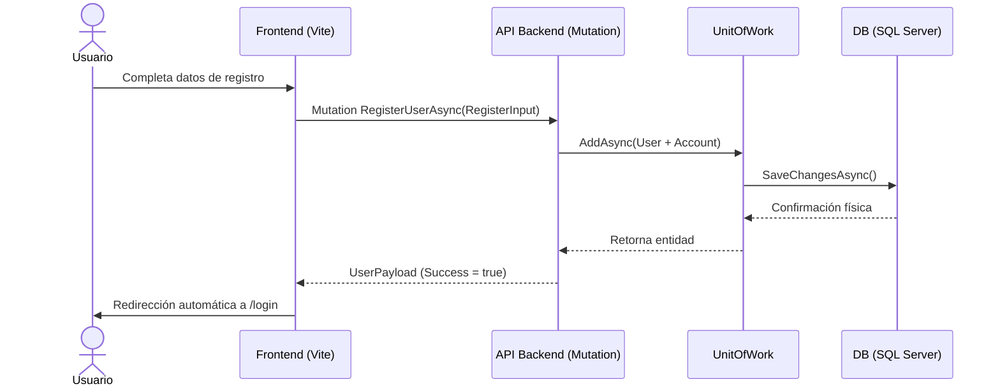
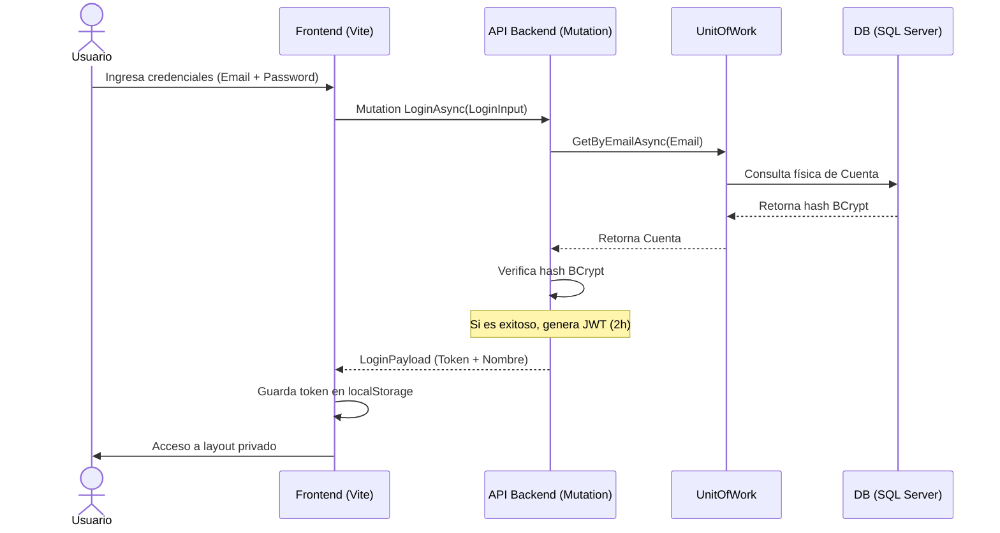
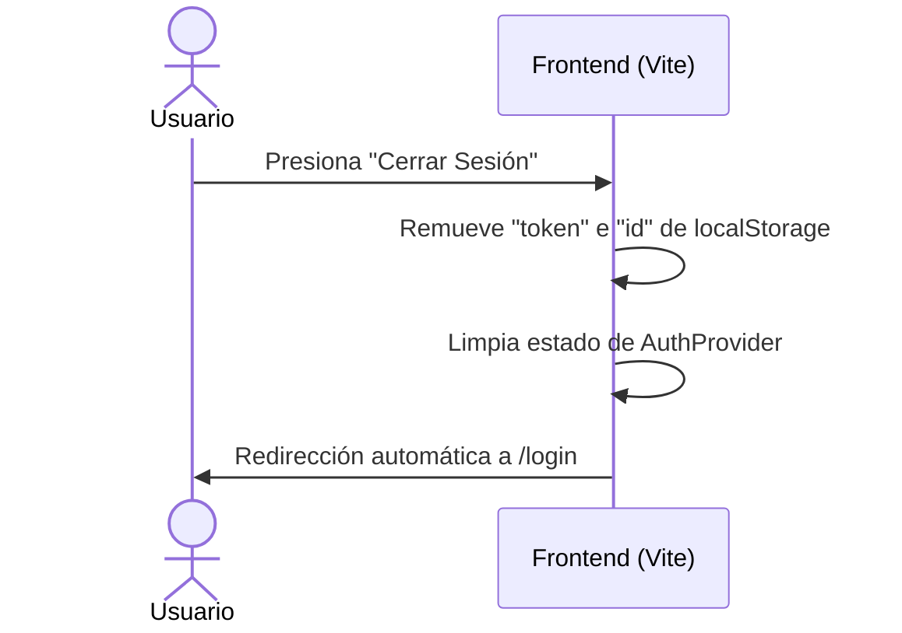
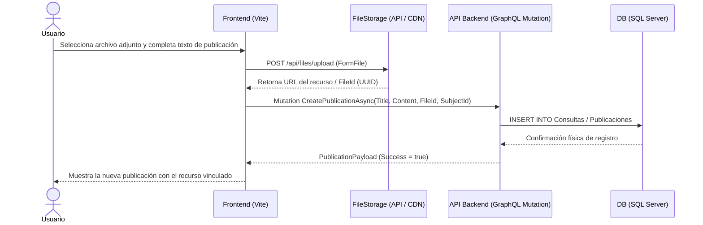
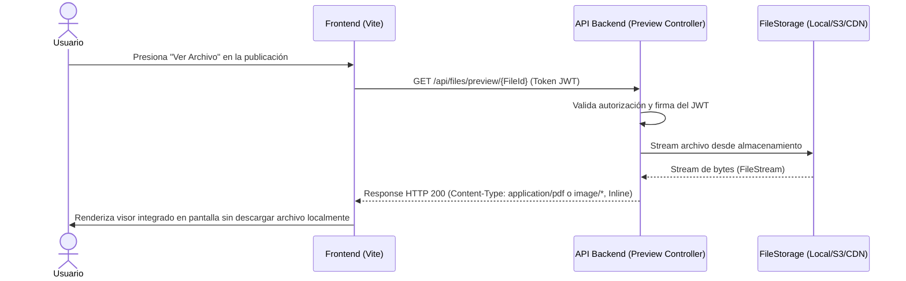

# Especificación de Diseño y Arquitectura - OneITB23

> Documento de diseño histórico. Los flujos REST de archivos descritos más
> abajo son propuestas no implementadas y requieren una decisión constitucional
> antes de desarrollarse. La arquitectura operativa vigente usa `/graphql`.

Este documento recopila las decisiones de diseño técnico, el Diagrama de Entidad-Relación (DER) y los diagramas de secuencia corregidos para la evaluación de arquitectura de **OneITB23**.

---

## 1. Patrones Arquitectónicos y Estructura
El sistema implementa una arquitectura desacoplada por dominios:
* **Backend**: Desarrollado en .NET 8 con Entity Framework Core 8. Implementa los patrones **Repository y Unit of Work**, aunque algunos resolvers del feed todavía acceden directamente a `OneItbContext` y deben normalizarse.
* **Frontend**: Desarrollado en React + Vite, consumiendo datos mediante **Apollo Client** de forma asíncrona.

---

## 2. Correcciones de Diseño Técnico (Resolución de Evaluaciones)

### 2.1. Normalización del Modelo de Datos (DER)
* **Tabla Cuentas (`Account`)**: Se agregó el campo `State` (estado de admisión/bloqueo de la cuenta) para dar soporte al control de admisión.
* **Países (`Country`)**: Normalización física de la entidad país en una tabla independiente, vinculada mediante llaves foráneas en lugar de almacenar strings duplicados.
* **Exclusiones de Seguridad**: Se aplica la exclusión física del campo `Password` en el esquema de resolvedores mediante `[GraphQLIgnore]` para cumplir con las directivas constitucionales.

### 2.2. Diagrama de Clases (Correcciones Aplicadas)
* **Clase Usuario (`User`)**: 
  - El método `Add` se documenta con su tipo de retorno específico (`Task<UserPayload>`).
  - El método `Edit` se re-especifica listando únicamente los parámetros editables (Nombre, Apellido, Rol) y exponiendo métodos accesores `GET` explícitos.
* **Clase Publicación (`Publication`)**:
  - Se añade de forma obligatoria la relación directa con la entidad `Subject` (Materia/Curso).
* **Relación Publicación-Comentario**:
  - Se define físicamente mediante una **Composición** (rombo negro), dado que la existencia del comentario depende de manera exclusiva de la publicación padre.
* **Enumeraciones de Usuario (`UserEnum`)**:
  - Mapeadas en el diagrama de clases usando flechas con punta abierta (Generalización/Especialización).
* **Ampliación de Alcance (Clase `Subject`)**:
  - Para representar un mayor alcance del sistema, se incorpora la entidad `Subject` (Materia) con métodos explícitos como `CreateSubjectAsync(SubjectInput)` y `GetSubjectsByCareer(int careerId)` en los diagramas de clases, otorgando soporte de administración institucional.

---

## 3. Diagramas de Secuencia Corregidos (Flujos de Negocio)

### 3.1. Flujo de Registro de Usuario

### 3.2. Flujo de Inicio de Sesión (Login)

### 3.3. Flujo de Cierre de Sesión (Logout)

*(Nota: Conforme a las correcciones evaluadas, el cierre de sesión se realiza enteramente en el lado del cliente limpiando los estados locales de sesión, sin disparar operaciones de creación en el servidor).*

### 3.4. Flujo de Creación de Publicación con Carga Desacoplada de Archivo

*(Nota: El archivo físico se sube por un canal REST asíncrono e independiente para optimizar el rendimiento de la mutación GraphQL).*

### 3.5. Flujo de Vista Previa de Archivo (Preview Endpoint)

