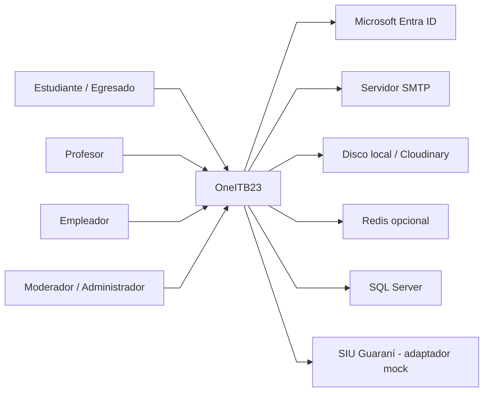
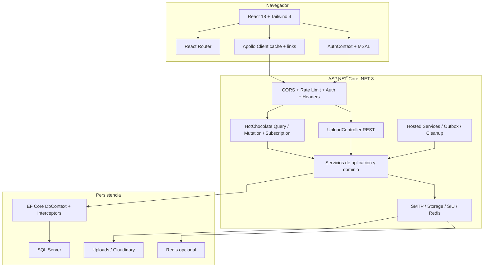
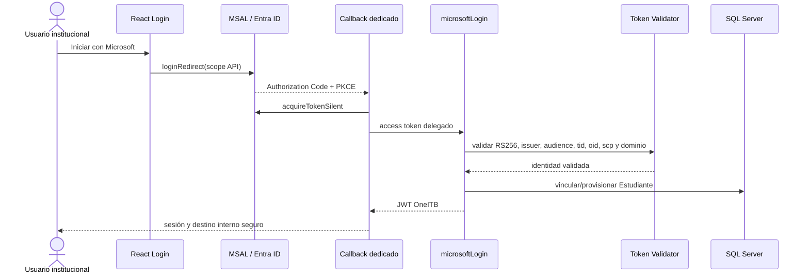
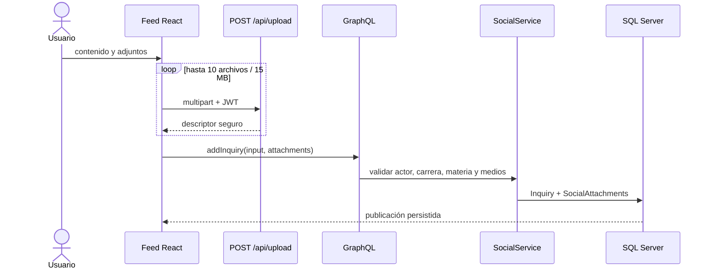
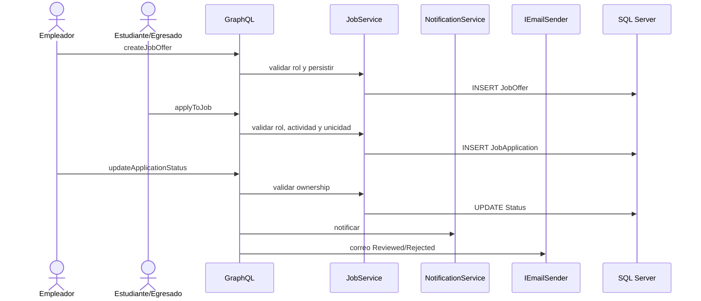
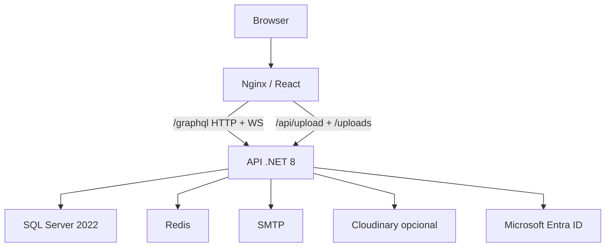

# Arquitectura y diseño de OneITB23

| Dato de control | Valor |
|---|---|
| **Última contrastación con código** | 4 de agosto de 2026 |
| **Estado documental** | Normalizado; arquitectura implementada con gates y brechas explícitas |
| **Baseline técnico** | .NET 8, EF Core 8.0.6, HotChocolate 14.2.0, React 18, Apollo Client 3.7, Vite 8 y Tailwind CSS 4 |
| **Ámbito** | Aplicación web, API, persistencia, tiempo real, archivos, correo, identidad e infraestructura |
| **Fuente de estado** | `ROADMAP.md`; este documento no asigna porcentajes ni eleva ítems a verificados |
| **Fuente de riesgos** | `FINAL_AUDIT_REPORT.md` y sección 15 de este documento |

Este documento describe **cómo está construido el sistema vigente** y qué decisiones
condicionan su evolución. No reemplaza al contrato funcional, al runbook ni a la evidencia
de pruebas. Una capacidad implementada sin aceptación en destino conserva su gate.

---

## 1. Propósito, alcance y atributos de calidad

### 1.1 Propósito arquitectónico

OneITB23 es una red social académica institucional que integra identidad, perfiles/CV,
muro segmentado por carrera, mensajería privada, recursos y progreso académico,
moderación, notificaciones y una Bolsa de Trabajo con Gestor de Ofertas y Postulaciones.
La arquitectura prioriza separación de responsabilidades, autorización en servidor,
integridad relacional, operación local reproducible y adaptadores reemplazables.

### 1.2 Atributos de calidad prioritarios

| Atributo | Respuesta arquitectónica |
|---|---|
| Seguridad | JWT local, BCrypt, lockout, autorización declarativa/contextual, límites de entrada, rate limiting y secretos fuera del repositorio |
| Integridad | FKs explícitas, `DeleteBehavior.Restrict`, constraints SQL, soft delete y transacciones críticas |
| Rendimiento | Paginación acotada, `AsNoTracking`, split queries, DataLoaders, índices y cancelación de I/O |
| Escalabilidad | API sin sesión de servidor, Redis opcional para Pub/Sub/limiters y almacenamiento intercambiable |
| Resiliencia | Error boundary, error filter GraphQL, Outbox, workers acotados y fallbacks de Development |
| Trazabilidad | Correlation ID, `AuditLog`, `ModerationAudit` y estados persistentes |
| Mantenibilidad | Servicios de dominio, contratos GraphQL, composición por interfaces y documentación canónica |
| Usabilidad | UI en español, temas Clean Tech/Tech Noir, loading/error y onboarding explícito |

### 1.3 Restricciones constitucionales

1. Frontend y backend son aplicaciones separadas.
2. GraphQL `/graphql` es el contrato de negocio por HTTP y WebSocket.
3. `POST /api/upload` es la única excepción REST aprobada para binarios.
4. Las reglas no triviales pertenecen a servicios; React no es frontera de autorización.
5. Passwords, tokens y secretos no se registran ni versionan.
6. Las FKs son explícitas y el dominio usa `Restrict`, salvo excepción documentada.
7. Compilar no demuestra por sí solo schema, persistencia o flujo funcional.

---

## 2. Contexto del sistema



### 2.1 Actores y fronteras

- **Institucionales:** Estudiante, Profesor, Egresado, Moderador y Administrador.
- **Externo controlado:** Empleador, creado por aprobación Admin o seed; nunca por alta pública directa.
- **Empresa solicitante:** actor anónimo que presenta una solicitud sin obtener privilegios.
- **Entra ID:** proveedor institucional cuyo token se canjea por el JWT local.
- **SMTP, Redis y Cloudinary:** dependencias configurables con aceptación real pendiente.
- **SIU:** integración desacoplada; la implementación actual es simulada.

---

## 3. Vista lógica de componentes



### 3.1 Responsabilidades

| Capa | Responsabilidad | No debe hacer |
|---|---|---|
| React | Vista, interacción, accesibilidad, estado efímero y navegación | Autorizar o asumir que ocultar un control protege la API |
| Apollo | HTTP/WS, caché, paginación, reconciliación y sesión | Persistir secretos o cruzar datos entre identidades |
| GraphQL | Contratos, autorización declarativa, adaptación de errores y delegación | Concentrar reglas complejas en resolvers |
| Servicios | Validación contextual, ownership, scoping, transacciones y efectos | Depender de presentación React |
| EF Core | Mapeo, constraints, consultas, migraciones e interceptores | Inferir relaciones mediante shadow properties |
| Adaptadores | Encapsular SMTP, storage, SIU y Pub/Sub | Filtrar secretos o cambiar reglas de negocio |
| Workers | Procesar Outbox, recordatorios y limpieza en lotes | Detener la API por fallos recuperables |

---

## 4. Stack y estructura física

### 4.1 Stack vigente

| Capa | Tecnología | Observación |
|---|---|---|
| Host API | ASP.NET Core sobre .NET 8 | `Program.cs` crea el host y `Startup.cs` compone servicios/pipeline |
| API | HotChocolate 14.2.0 | HTTP, WS, proyecciones, filtros, sorting, paginación y error filter |
| Datos | EF Core 8.0.6 y SQL Server 2022 | SQL Docker local canónico; Azure SQL es objetivo |
| Web | React 18, Router 6.30, Apollo 3.7 y Vite 8 | JavaScript/JSX predominante con piezas TSX |
| Diseño | Tailwind CSS 4 y FontAwesome 6.6 | Clean Tech y Tech Noir |
| Tiempo real | GraphQL Subscriptions | In-memory o Redis por configuración |
| Identidad | JWT, BCrypt y Microsoft Entra/MSAL | Authorization Code + PKCE y JWT local |
| Archivos | REST upload + `IFileStorageService` | Disco local o Cloudinary |
| Correo | `IEmailSender` | SMTP o pickup local en Development |
| Infraestructura | Docker Compose y Nginx | Plantilla productiva implementada, destino no aceptado |
| Mobile | React Native/Expo planificado | Sin código mobile versionado |

### 4.2 Estructura del repositorio

```text
API Graphql/
|-- Entities/          modelos y enums
|-- Data/              DbContext, migraciones, inicialización y seed
|-- Services/          dominio, repositorios e interfaces
|-- Tests/             suites backend
`-- OneITB/            host, GraphQL, controllers, auth, workers y adaptadores

FrontEnd/OneItb-FE/
|-- src/Components/    vistas y componentes por dominio
|-- src/context/       autenticación y tema
|-- src/data/graphql/  provider y operaciones Apollo
|-- src/hooks/         comportamiento compartido
|-- src/router/        rutas públicas/privadas y callback Entra
|-- src/auth/          configuración y flujo Microsoft
`-- src/utils/         parsing, media y utilidades

docs/
|-- project_docs/      alcance, arquitectura y Roadmap
|-- audit/             runbook, auditoría, estado e historial
|-- academic/          derivados para defensa
`-- entrega_final/     memoria y guía de maquetación
```

---

## 5. Contratos de transporte

### 5.1 GraphQL

- `/graphql` por HTTP atiende queries y mutations.
- `/graphql` por WebSocket atiende mensajes, notificaciones y ofertas.
- HotChocolate registra Query, Mutation y Subscription, proyecciones, filtros, sorting,
  DataLoaders y autorización.
- El schema actual contiene **47 resolvers mutacionales**: seis públicos controlados
  (`registerUser`, `login`, `microsoftLogin`, `requestMagicLink`, `loginWithMagicLink` y
  `submitEmployerRequest`) y 41 con `[Authorize]`.
- `GraphQLErrorFilter` evita devolver detalles internos sin procesar.

### 5.2 Límites GraphQL vigentes

| Control | Default en código | Propósito |
|---|---:|---|
| Profundidad | 15 | Acotar anidación |
| Costo de campo | 200000 | Limitar carga agregada |
| Costo de tipo | 200000 | Limitar expansión costosa |
| Nodos parser | 50000 | Acotar estructura |
| Tokens parser | 100000 | Acotar entrada léxica |
| Campos parser | 20000 | Acotar selecciones |
| Página default | 20 | Evitar colecciones ilimitadas |
| Página máxima | 50 | Techo global |

Son configurables. Los valores altos de parser/costo permiten operaciones reales complejas;
antes de exposición pública deben calibrarse con telemetría y pruebas de carga.

### 5.3 Upload REST desacoplado

1. React envía `multipart/form-data` con JWT a `POST /api/upload`; el request acepta
   cancelación para que un cambio de sesión o desmontaje no complete trabajo obsoleto.
2. El controller exige autenticación, tamaño total, extensión y nombre seguro.
3. `IFileContentInspector` valida firma y estructura antes de persistir.
4. `IFileStorageService` devuelve URL, nombre original, MIME y tamaño; la respuesta REST
   agrega `storageMode` (`Local` o `Cloudinary`) sin exponer configuración ni credenciales.
5. El frontend trata esa URL como candidata. GraphQL la asocia al perfil o entidad y un
   refetch acotado confirma la persistencia antes de reemplazar el valor canónico.
6. Fallos del proveedor se registran con modo y correlación, nunca con secretos o cuerpos
   externos, y se mapean a HTTP 503 con `UPLOAD_STORAGE_UNAVAILABLE`.

`CvEditorProfile` no inicializa campos desde el resumen de autenticación. Espera un `me`
completo cuyo identificador coincida con la sesión, muestra un skeleton integral y aplica
un único snapshot inicial por identidad. Refetches tardíos no sobrescriben un draft sucio;
un cambio de sesión aborta upload/lectura pendiente y descarta el estado anterior. El avatar
persistido se conserva hasta que upload, `updateProfile` y refetch confirman la nueva URL.

`/uploads/{file}` entrega objetos locales como estáticos. Simplifica demo y rich media,
pero no autoriza por objeto; este límite se registra como `GAP-FILE-01`.

### 5.4 CORS, headers y proxy

- GraphQL/controllers permiten solo orígenes configurados y no usan cookies; JWT viaja en `Authorization`.
- WebSocket mantiene su propia allowlist de orígenes.
- El middleware emite `nosniff`, `X-Frame-Options: DENY`, referrer y permissions policy.
- Static files agrega CORS `*` y `Cross-Origin-Resource-Policy: cross-origin`.
- Nginx sirve SPA y proxyea `/graphql`, `/api` y `/uploads`, incluido WebSocket.
- PDF completo se recupera por `fetch` y Blob URL; no se relaja `X-Frame-Options`.

---

## 6. Identidad y autorización

### 6.1 Cuenta y sesión local

`Account` conserva email/credenciales; `User` conserva perfil, rol y dominio. Comparten
`Guid` en relación 1:1. El JWT local es la credencial de resolvers protegidos, sea cual
fuere el origen de identidad.

- BCrypt mediante `IPasswordHasher`, costo 12 default y rango 10-14.
- Cinco fallos generan lockout persistente de 15 minutos.
- JWT exige issuer, audience, expiración y clave externa de al menos 32 bytes.
- Logout/cambio de identidad limpia storage, Apollo, WebSocket y respuestas tardías.

### 6.2 Microsoft Entra ID



La SPA es pública y no posee client secret; la API expone `access_as_user`. La autoridad
`common` admite múltiples organizaciones, pero backend usa metadata tenant-specific y
valida `itbeltran.com.ar`. Altas nuevas reciben solo Estudiante; privilegiados no se
vinculan automáticamente. Falta aceptación con tenant/cuenta Microsoft 365 reales.

### 6.3 Magic Link y empresa

- Credencial aleatoria de 256 bits; SQL conserva solo SHA-256.
- Respuesta pública genérica, limiter por IP/identidad y fingerprint HMAC.
- Consumo único, atómico, expirable y protegido contra replay.
- Token en fragmento URL eliminado por React antes del consumo.
- Empresa obtiene rol Empleador solo tras aprobación Admin serializable.
- Outbox desacopla SMTP con lease, reintentos y errores sanitizados.

### 6.4 Modelo de autorización

La primera barrera es declarativa (`[Authorize]` y roles). Los servicios agregan identidad
activa, ownership, carrera, estado, bloqueo/silenciamiento y relaciones necesarias.
Los roles son Estudiante, Profesor, Egresado, Empleador, Moderador y Administrador. El
valor legacy `User` no debe asignarse en nuevos flujos.

Controles cerrados por Spec 201:

- El registro público valida dominio institucional en backend, asigna únicamente
  `Estudiante`, limita abuso por origen/identidad y no revela duplicados.
- Las operaciones del Profesor se acotan a las carreras enlazadas por `UserCareer`; esta
  política equivalente se aplica a recursos, listados y progreso. Administrador conserva
  alcance global.

### 6.5 Privacidad

`IsPublicProfile` enmascara server-side bio, contacto, carreras, CV y métricas. Solo el
propietario, Administrador y Moderador acceden a esos datos cuando el perfil es privado.
La Spec 201 eliminó la arista unilateral `Follow` como fuente de autorización; seguir es
una relación social y nunca equivale a consentimiento de privacidad.

---

## 7. Modelo de dominio y persistencia

```mermaid
erDiagram
    ACCOUNT ||--|| USER : authenticates
    ACCOUNT ||--o{ MAGIC_LINK : owns
    USER o|--o{ EMPLOYER_REQUEST : processes
    USER o|--o| EMPLOYER_REQUEST : provisioned_as
    EMPLOYER_REQUEST ||--o| EMPLOYER_ONBOARDING_OUTBOX : enqueues
    USER ||--o{ USER_CAREER : enrolls
    CAREER ||--o{ USER_CAREER : includes
    CAREER ||--o{ SUBJECT : defines
    SUBJECT ||--o{ SUBJECT_PREREQUISITE : subject
    SUBJECT ||--o{ SUBJECT_PREREQUISITE : prerequisite
    USER ||--o{ INQUIRY : authors
    SUBJECT ||--o{ INQUIRY : classifies
    INQUIRY ||--o{ COMMENT : contains
    COMMENT ||--o{ COMMENT : replies
    USER ||--o{ COMMENT : writes
    INQUIRY ||--o{ REACTION : receives
    USER ||--o{ REACTION : creates
    COMMENT ||--o{ COMMENT_REACTION : receives
    USER ||--o{ COMMENT_REACTION : creates
    INQUIRY ||--o{ SOCIAL_ATTACHMENT : attaches
    COMMENT ||--o{ SOCIAL_ATTACHMENT : attaches
    INQUIRY ||--o{ COMMUNITY_REPORT : reported
    USER ||--o{ COMMUNITY_REPORT : reports
    USER ||--o{ USER_INTERACTION : observes
    USER ||--o{ USER_INTERACTION : targeted
    USER ||--o{ MESSAGE : sends
    USER ||--o{ MESSAGE : receives
    SUBJECT ||--o{ ACADEMIC_RESOURCE : provides
    USER ||--o{ ACADEMIC_RESOURCE : uploads
    SUBJECT ||--o{ ACADEMIC_PROGRESS : tracks
    USER ||--o{ ACADEMIC_PROGRESS : owns
    USER ||--o{ ACADEMIC_PROGRESS : assigns
    USER ||--o{ JOB_OFFER : publishes
    JOB_OFFER ||--o{ JOB_APPLICATION : receives
    USER ||--o{ JOB_APPLICATION : applies
    USER ||--o{ NOTIFICATION : receives
    INQUIRY ||--o{ NOTIFICATION : groups
    USER ||--o{ NOTIFICATION_PREFERENCE : configures
    USER ||--o{ MODERATION_AUDIT : acts
    USER ||--o{ AUDIT_LOG : performs
```



### 7.1 Inventario persistido

`Account`, `User`, `Career`, `UserCareer`, `Subject`, `SubjectPrerequisite`, `Inquiry`,
`Comment`, `Reaction`, `CommentReaction`, `SocialAttachment`, `CommunityReport`,
`UserInteraction`, `Message`, `AcademicResource`, `AcademicProgress`, `Notification`,
`NotificationPreference`, `ModerationAudit`, `AuditLog`, `MagicLink`, `EmployerRequest`,
`EmployerOnboardingOutboxMessage`, `JobOffer`, `JobApplication`, `UserCvExperience`,
`UserCvEducation`, `UserCvProject`, `UserCvSkill` y `UserCvLanguage`.

### 7.2 Reglas relacionales

- Relaciones de dominio usan `DeleteBehavior.Restrict`.
- `Account`-`User` conserva cascade como excepción de agregado.
- `Inquiry`/`Comment` filtran `IsActive` e `IsHiddenByModerator`.
- `SocialAttachment` impone XOR entre Inquiry y Comment.
- Reacciones son únicas por contenido/usuario.
- `SubjectPrerequisite` prohíbe autorreferencia.
- `JobApplication` es única por oferta/postulante.
- Identidad Entra es única por proveedor/tenant/subject.
- `RowVersion` protege notificaciones y solicitudes empresariales.
- No se admiten shadow properties.

### 7.3 Trazabilidad

- `Inquiry` y `Comment`: soft delete autoral y ocultamiento moderado separados.
- `AcademicResource` y `JobOffer`: desactivación lógica.
- `ModerationAudit`: acciones de moderación con actor/objetivo.
- `AuditSaveChangesInterceptor`: snapshots acotados en `AuditLog`.

---

## 8. Diseño de módulos

### 8.1 Muro y archivos



`inquiriesPage` usa cursor opaco, orden estable, máximo 25 y scoping por carrera. El media
grid limita altura, adapta portada/orientación, admite documentos, imágenes y hasta dos
YouTube. PDF.js se carga diferido y rasteriza la primera página con cleanup.

### 8.2 Comentarios y moderación

- Máximo dos niveles; respuestas adicionales usan mención.
- `ReplyToUserId` deriva de un comentario visible del mismo Inquiry.
- Likes son únicos y acciones propias no notifican.
- Reportes evitan duplicados pendientes.
- Autor edita/elimina; Moderador/Admin oculta/restaura con motivo y auditoría.
- Silenciamiento se valida antes de leer o mutar estado social.

### 8.3 Mensajería y notificaciones

Mensajes persistidos se publican en topics privados. Apollo reconcilia historial paginado,
eventos y optimismo. Notificaciones respetan preferencias y se agrupan con `GroupKey`,
`AggregateCount`, `UpdatedAt` y `RowVersion`; el badge cuenta solo no leídas.
El worker de recordatorios procesa hasta 500 destinatarios y hace upsert idempotente.
Redis distribuye Pub/Sub; memoria sirve únicamente para una instancia local.

### 8.4 Académico

- Recursos por materia/carrera con lectura y carga autorizadas según rol/inscripción.
- Progreso actual por Estudiante/Materia con nota, estado, notas y asignador.
- Estudiante lee lo propio; Admin posee alcance global.
- Profesor escribe y lista solo dentro de materias pertenecientes a sus carreras
  vinculadas; la política se aplica en servicio y cuenta con regresión allow/deny.
- `ISiuIntegrationService` aísla SIU; el adaptador actual es mock idempotente.

La identidad académica manual de un `Estudiante` exige exactamente una carrera activa.
`IStudentEnrollmentService` obtiene el actor desde el JWT, valida rol y estado de la
carrera y reemplaza los vínculos dentro de una transacción serializable en SQL Server.
El frontend utiliza `confirmStudentCareer(careerId)` y no habilita el área privada hasta
que un refetch de `me` devuelve la misma identidad con ese único vínculo. El resolver
legacy de listas y `updateProfile` aplican la misma política para impedir bypasses; los
roles institucionales que pueden representar varias carreras conservan la relación N:M.

`IInstitutionalEnrollmentProvider` es el puerto futuro para consultar matrícula y
materias en una fuente autorizada del ITB o SIU. Su contrato normaliza códigos conocidos
y distingue `Confirmed`, `ManualConfirmationRequired` y `Unavailable`. En el corte
actual se registra `ManualInstitutionalEnrollmentProvider`: no realiza HTTP ni fabrica
inscripciones. Esta frontera es deliberadamente distinta de `ISiuIntegrationService`,
que sólo demuestra sincronización mock de calificaciones. Un adaptador real requerirá
contrato, autenticación, mapeo, aceptación institucional y pruebas con el proveedor.

### 8.5 Bolsa de Trabajo



Un fallo SMTP no revierte el cambio de estado. La UI se denomina Gestor de Ofertas y
Postulaciones, sin prometer un sistema de selección empresarial completo.

### 8.6 Onboarding B2B

Honeypot se procesa antes de PII; email/CUIT se normalizan, se exige consentimiento y la
respuesta es genérica. Admin aprueba/rechaza/reintenta. La aprobación serializable fija rol
Empleador y encola correo. El audit no copia el motivo sensible de rechazo.

### 8.7 CV y credenciales

El CV usa tablas relacionales para experiencia, educación, proyectos, skills e idiomas.
`CVATSPrintTemplate` proyecta esos datos en un único flujo semántico de una columna que
comparten `/profile` y `/profile/edit`; los controles permanecen fuera del nodo imprimible.
`useCvAtsPrint` usa `react-to-print` para clonar solo ese documento, aplicar A4 con márgenes
seguros y conservar texto/enlaces sin depender de avatar, canvas, tablas ni paginación
simulada. El contenido crece entre páginas y nunca usa altura fija u `overflow-hidden`.
Un script local acotado puede inspeccionar el PDF con Poppler sin persistir su texto.
Esta arquitectura permite afirmar **PDF optimizado para ATS**, no compatibilidad universal.
El progreso puede exportarse como CSV y la ruta `/certificate/{id}` expone solo progreso
aprobado/activo. Open Graph completo queda condicionado a SSR o HTML de servidor.

---

## 9. Arquitectura frontend

### 9.1 Composición

1. `GlobalErrorBoundary` envuelve Apollo, Theme y aplicación.
2. `ThemeProvider` gestiona Clean Tech/Tech Noir e impresión.
3. Router separa público, privado, callback Microsoft y certificados.
4. `AuthProvider` es la frontera de identidad local.
5. `NotificationProvider` escucha solo con sesión válida.
6. Estudiante con cero o más de una carrera queda bloqueado en onboarding hasta
   confirmar exactamente una y validarla mediante refetch de `me`.

### 9.2 Apollo y sesión

- `HttpLink` atiende Query/Mutation y `GraphQLWsLink` Subscription mediante `split`.
- Bearer token por HTTP y connection params por WS.
- Type policies controlan identidad y merges paginados.
- Logout/expiración limpia cache, storage y WS e invalida respuestas por epoch.
- Callback Entra canjea una vez por flow ID aun con Strict Mode.
- Redirects y deep-links se sanitizan a rutas internas.

### 9.3 Ciclo de vida

- Suscripciones/listeners limpian recursos en `useEffect`.
- Media fetch usa abort; Blob URLs y observers se revocan.
- Loading, empty, error y retry forman parte del contrato visual.
- Token Entra vive solo en memoria/MSAL `sessionStorage`.

### 9.4 Navegación adaptativa e identidad visual

- Los destinos privados se construyen desde descriptores únicos con ruta, roles,
  prioridad, estado activo y badge. La representación directa y el overflow consumen el
  mismo contrato para evitar divergencias.
- Un `ResizeObserver` mide el ancho realmente disponible entre el lockup y los controles
  fijos. Se muestra el mayor prefijo que entra y se reserva un único botón para el sufijo
  restante; no existe un breakpoint rígido que oculte todo el menú.
- El overflow cierra por Escape, clic exterior, navegación, cambio de ruta o sesión y
  restaura foco cuando corresponde. Los listeners, observer y frames tienen cleanup.
- `BrandLockup` combina el isotipo transparente, que representa la `O`, con el wordmark
  DOM exacto `neITB` en una unidad no separable. La legibilidad dark usa color del tema,
  no bloom raster.

### 9.5 Recursos visuales locales

- La tipografía base es un stack del sistema operativo; impresión usa fallbacks
  explícitos Arial/Segoe UI.
- Font Awesome 6.7.2 se fija como dependencia npm exacta; Vite importa su CSS y genera
  rutas versionadas para WOFF2. Un test compara cada clase activa con la metadata del
  mismo paquete y valida versión, integridad, licencia y archivos requeridos.
- Google Fonts, gstatic, cdnjs y generadores remotos de avatar no forman parte del bundle.
  Los avatares ausentes o fallidos degradan a iniciales locales accesibles.
- El documento raíz declara español, título OneITB y favicon del repositorio. Estos
  controles mejoran la contingencia offline, pero su aceptación visual sigue siendo un
  gate de navegador.

---

## 10. Datos, rendimiento y concurrencia

- `AddPooledDbContextFactory` crea contextos y registra auditoría.
- Split query global reduce explosión cartesiana.
- Lecturas aplican `AsNoTracking` y `AsSplitQuery` según grafo.
- Batch DataLoaders agrupan métricas y reportes.
- `CancellationToken` llega a EF y efectos compatibles.
- Feed máximo 25; paging global default 20/máximo 50.
- Mensajes, empleos, estudiantes y listados Admin tienen límites explícitos.
- Magic Link es atómico; notificaciones y solicitudes usan concurrencia optimista.
- Seed persiste por fases, limpia `ChangeTracker` y usa IDs determinísticos.

---

## 11. Adaptadores por ambiente

| Interfaz | Development/aceptación | Producción objetivo | Regla |
|---|---|---|---|
| SQL | SQL Server Docker + SQL Auth | SQL administrado con TLS validado | Secretos fuera de Git |
| Pub/Sub | In-memory o Redis local | Redis administrado | Memoria no escala horizontalmente |
| Storage | `wwwroot/uploads` | Cloudinary | Disco local no es distribuido |
| Email | Pickup `.eml` o Mailpit | SMTP real | Producción no degrada a pickup |
| SIU | Mock | Adaptador real futuro | No afirmar integración real |
| Entra | Deshabilitado sin config | Dos App Registrations | Config parcial habilitada falla al iniciar |

Los fallbacks facilitan desarrollo; no equivalen a verificación productiva.

---

## 12. Despliegue



### 12.1 Local

- `docker-compose.yml`: SQL local canónico.
- `docker-compose.acceptance.yml`: Redis y Mailpit para pruebas finitas.
- Backend/Vite usan secrets/env fuera de Git.
- Vite proxyea GraphQL, WS, upload y archivos.
- Seed demo es idempotente, configurable y deshabilitado por defecto en Production.

### 12.2 Compose productivo

`docker-compose.prod.yml` contiene SQL, Redis, API y Nginx, Dockerfiles multi-stage,
health checks, volúmenes y variables obligatorias. Es una plantilla implementada, no un
despliegue certificado. La Spec 201 retiró la cadena SQL embebida con trust bypass: el
destino debe inyectar `ONEITB_DB_CONNECTION_STRING` como secreto, con `Encrypt=True`,
`TrustServerCertificate=False` y una cadena de confianza verificable.

### 12.3 Escalamiento

La API puede replicarse cuando Redis y storage son compartidos. Disco local impide
coherencia horizontal. El proxy debe preservar WebSocket; el destino requiere balanceador,
health probes y observabilidad central.

---

## 13. Seguridad y fronteras de confianza

| Frontera | Amenaza | Control actual | Límite |
|---|---|---|---|
| Browser -> GraphQL | Suplantación/DoS | JWT, roles, ownership, rate/cost/depth | Calibrar con carga |
| Browser -> upload | Archivo hostil | Auth, tipo, magic bytes, estructura y tamaño | Antivirus/CDR |
| Lectura `/uploads` | Acceso directo | Nombre GUID y masking de metadatos | Sin autorización por objeto |
| Password | Fuerza bruta | BCrypt, lockout y error genérico | Benchmark destino |
| Magic Link | Enumeración/replay | Genérico, digest, single-use y limiter | SMTP real |
| Entra -> API | Token ajeno | RS256, audience, scope, tid, oid y dominio | Tenant real |
| Solicitud B2B | Spam/PII/privilegio | Honeypot, consentimiento, limiter y Admin | Monitoreo |
| API -> SQL | MITM/credenciales | TLS y secretos externos | Certificado validado |
| Sesión A -> B | Session bleed | Clear store, cierre WS y epoch | Regresión final |

---

## 14. Observabilidad y recuperación

- `CorrelationIdMiddleware` identifica solicitudes y se propaga a logs/auditoría.
- Logging usa consola/debug; falta backend central aceptado.
- `/health/live` verifica vida del proceso; `/health/ready` comprueba conectividad SQL y
  `/health` conserva el agregado. Los adaptadores externos requieren probes/alertas del
  ambiente de destino.
- `AuditLog` cubre cambios críticos y `ModerationAudit` semántica específica.
- Workers registran fallos y continúan según reintento.
- Rebaseline demo valida destino, crea backup, migra y ejecuta seed dos veces.
- Producción requiere alertas, retención, backup/restore, rotación, rollback e incident response.

---

## 15. Decisiones y brechas vigentes

### 15.1 Decisiones consolidadas

| Decisión | Consecuencia |
|---|---|
| GraphQL de negocio; REST solo upload | Contratos centralizados y binarios desacoplados |
| JWT local canónico | Password, Magic Link y Entra convergen |
| `DeleteBehavior.Restrict` (AD-004) | Evita cascadas; exige soft delete/eliminación explícita |
| SQL Docker local | Evita Windows Auth/LocalDB |
| Adaptadores Redis/Cloudinary/SMTP | Reemplazo por ambiente |
| CV relacional | Consultable y evolucionable |
| Outbox empresarial | SMTP fuera de transacción con reintentos |
| Soft delete + hide moderado | Autoría y auditoría sin edición de terceros |
| Código/GraphQL inglés, UI español (AD-012) | Consistencia técnica e institucional |

### 15.2 Brechas

| ID | Severidad recomendada | Brecha | Tratamiento |
|---|---|---|---|
| `GAP-AUTH-01` | Alta piloto | **Resuelta:** registro público Student-only, dominio backend, anti-enumeración y limiter | Mantener pruebas y aprovisionar roles staff por flujo confiable |
| `GAP-AUTH-02` | Alta piloto | **Resuelta:** Profesor acotado a materias de carreras vinculadas | Evolución opcional a Profesor-Materia/Cursada si se requiere granularidad adicional |
| `GAP-PRIV-01` | Alta privacidad | **Resuelta:** Follow ya no habilita perfil privado | Mantener consentimiento explícito si se incorpora Follow aprobado |
| `GAP-FILE-01` | Alta piloto externo | **Aceptada solo para demo controlada:** `/uploads` sin autorización por objeto | Storage privado, URL firmada o endpoint autorizado antes de piloto abierto |
| `GAP-INFRA-01` | Alta producción | **Remediada en plantilla:** conexión completa externa sin trust bypass predeterminado | Proveer CA/endpoint real y ejecutar smoke TLS en destino |
| `GAP-OPS-01` | Media | **Parcial:** correlation ID, logs estructurados y probes live/ready; sin plataforma central aceptada | Integrar métricas/traces, alertas y respuesta a incidentes en destino |

`GAP-FILE-01` y la aceptación externa de infraestructura/observabilidad no bloquean una
demostración local con datos demo y usuarios conocidos. Sí bloquean una afirmación de
producción pública hasta que exista evidencia del ambiente de destino.

### 15.3 Gates externos

- Microsoft Entra con App Registrations, consentimiento y cuenta Microsoft 365.
- SMTP, Redis administrado y Cloudinary con proveedores reales.
- Benchmark BCrypt y realtime con dos sesiones sobre el SHA candidato.
- Antivirus/CDR antes de exposición amplia.
- Mobile/Azure como evolución postdefensa.

---

## 16. Trazabilidad y mantenimiento

| Necesidad | Fuente |
|---|---|
| Alcance, actores y reglas | `docs/project_docs/scope-and-requirements.md` |
| Estado, prioridades y tiempos | `docs/project_docs/ROADMAP.md` |
| Riesgos y dictamen | `docs/audit/FINAL_AUDIT_REPORT.md` |
| Instalación, secretos y recuperación | `docs/audit/RUNBOOK_DEV.md` |
| Historial | `docs/audit/DEVELOPMENT_LOG.md` |
| Diagramas derivados | `docs/academic/04-design-diagrams.md` |
| Memoria | `docs/entrega_final/DOCUMENTO_BASE_PRACTICA_PROFESIONAL.md` |

Este documento se actualiza ante cambios en entidades/relaciones, contratos, identidad,
roles, privacidad, adaptadores, topología, caché, realtime, workers o fronteras de confianza.
Cada cambio debe propagarse al alcance, Roadmap, auditoría, runbook, diagramas y memoria.
La evidencia concreta permanece en la spec o el informe de auditoría, no se duplica aquí.
