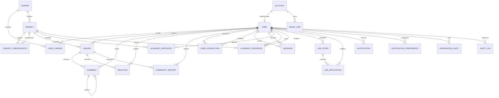
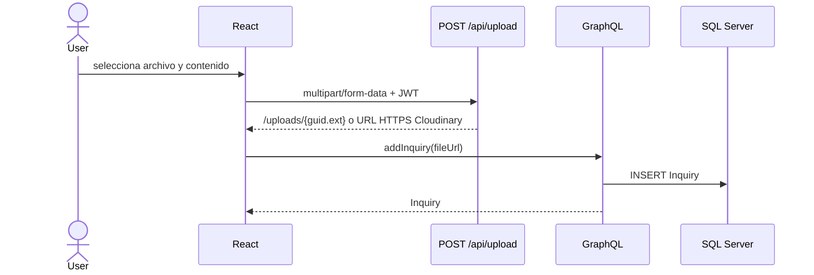
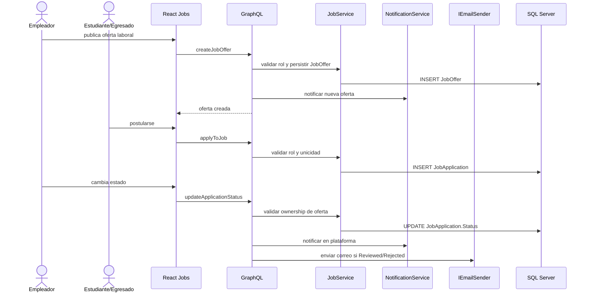

# Arquitectura y diseno de OneITB23

**Ultima alineacion con codigo**: 2026-07-08

## 1. Stack vigente

| Capa | Tecnologia |
|---|---|
| Backend | .NET 8 / ASP.NET Core |
| API de negocio | HotChocolate GraphQL 14.2.0 |
| Persistencia | Entity Framework Core 8.0.6 / SQL Server 2022 Docker local / Azure SQL objetivo |
| Frontend Web | React 18 / Apollo Client 3.7 / Vite 8 |
| Frontend Mobile | React Native / Expo planificado; no existe codigo mobile versionado |
| UI | Tailwind CSS 4 / FontAwesome 6.6 |
| Tiempo real | GraphQL Subscriptions sobre WebSocket; Redis Pub/Sub opcional en produccion |
| Archivos | `/api/upload` con disco local o Cloudinary por configuracion |
| Correo | SMTP configurable por `SmtpSettings` con fallback `ConsoleEmailService` |
| Despliegue e Infra | Docker multi-stage / Nginx reverse proxy / Redis / Cloudinary opcional / GitHub Actions |

## 2. Estructura fisica

```text
API Graphql/
|-- Entities/     modelos de dominio
|-- Data/         DbContext, inicializacion y migraciones
|-- Services/     reglas de negocio y acceso a datos
`-- OneITB/       host ASP.NET Core, GraphQL, upload REST, SMTP y middleware

FrontEnd/OneItb-FE/src/
|-- Components/   vistas y componentes por dominio
|-- context/      autenticacion y tema
|-- data/graphql/ operaciones Apollo
|-- hooks/        hooks compartidos
|-- router/       rutas publicas y privadas
`-- utils/        parsing y utilidades sin estado

Mobile/OneItb-App/
`-- planificado; no existe codigo versionado en el repositorio actual
```

## 3. Contratos de transporte e integraciones

- `/graphql` por HTTP: queries y mutations de aplicacion, incluyendo operaciones admin-only de smoke operativo.
- `/graphql` por WebSocket: mensajes privados, notificaciones y eventos de ofertas laborales.
- `POST /api/upload`: transferencia binaria autenticada y desacoplada, maximo 15 MB.
- `/uploads/{file}`: lectura de archivos estaticos almacenados localmente cuando no se usa Cloudinary.
- SMTP: salida de correo para eventos institucionales, actualmente cambios de estado de postulaciones.

Los binarios no se envian mediante GraphQL. Primero se obtiene una URL desde `/api/upload`; luego esa URL se persiste en `Inquiry.FileUrl`, `Comment.FileUrl` o `AcademicResource.FileUrl`.

Controles defensivos vigentes: `/graphql` y `/api/upload` tienen rate limiting fixed-window por IP; GraphQL aplica profundidad maxima configurable (`GraphQL:MaxExecutionDepth`, default 10) y limites globales de paginacion (`DefaultPageSize` 20, `MaxPageSize` 50). El login usa lockout persistente por cuenta (`FailedLoginAttempts`, `LockoutEnd`) para mitigar fuerza bruta aunque el atacante rote IPs. Los perfiles privados se enmascaran en el backend, no solo en React.

## 4. Modelo de dominio actual



Entidades persistidas: `Account`, `User`, `Career`, `UserCareer`, `Subject`, `SubjectPrerequisite`, `Inquiry`, `Comment`, `Reaction`, `CommunityReport`, `UserInteraction`, `Message`, `AcademicResource`, `AcademicProgress`, `Notification`, `NotificationPreference`, `ModerationAudit`, `AuditLog`, `MagicLink`, `JobOffer`, `JobApplication`, `UserCvExperience`, `UserCvEducation`, `UserCvProject`, `UserCvSkill` y `UserCvLanguage`.

Campos destacados recientes:

- `AcademicResource`: `Category`, `Version`, `FileUrl`, `ExternalUrl`, `IsActive`.
- `JobApplication`: `Status` (`Pending`, `Reviewed`, `Rejected`) con indice unico por `JobOfferId + ApplicantId`.
- `AuditLog`: `ActorUserId`, `CorrelationId`, `Action`, `EntityName`, `EntityId`, snapshots JSON acotados.
- `User.IsPublicProfile`: controla si terceros pueden ver bio, contacto, carreras, CV y metricas extendidas del perfil publico.

## 5. Integridad y borrado

- Las relaciones sociales, academicas, de publicaciones, comentarios, mensajes, empleos y postulaciones usan `DeleteBehavior.Restrict`.
- `Inquiry` y `Comment` usan soft-delete mediante `IsActive` y filtros globales.
- `AcademicResource` y `JobOffer` usan estado activo para no perder trazabilidad.
- La relacion 1:1 `Account`-`User` conserva cascade como excepcion explicita del agregado de identidad.
- Todas las claves foraneas relevantes se modelan de forma explicita; no se admiten shadow properties.

## 6. Flujos principales

### Publicacion con archivo



### Mensajeria privada y notificaciones

El historial se persiste en `Messages`. El envio publica un evento al topico privado del emisor y receptor; Apollo reconcilia historial, eventos y estado optimista. Las notificaciones se persisten en `Notifications` y se publican por topico privado `notification:{userId}` respetando preferencias.

### Recursos y progreso academico

Los recursos academicos se consultan por materia mediante `academicResources(subjectId, searchTerm, category)` y el alias compatible `resourcesBySubject(subjectId, searchTerm, category)`. Administradores, profesores y usuarios activos inscriptos en la carrera de la materia pueden cargar recursos; la lectura queda restringida por carrera salvo roles institucionales.

El progreso academico se persiste como un registro actual por estudiante y materia. Administradores y profesores asignan estado/nota mediante `upsertAcademicProgress`; el estudiante consulta solo su propio historial con `myAcademicProgress`.

### Adaptador SIU

La integracion SIU usa `ISiuIntegrationService` para aislar la plataforma externa. La implementacion actual `MockSiuIntegrationService` devuelve calificaciones simuladas; `AcademicService.SyncSiuGradesAsync` hace upsert idempotente en `AcademicProgress`, validando cuenta local, rol estudiante y pertenencia a la carrera.

### Empleos y Gestor de Postulaciones



La mutacion de estado no revierte la postulacion si falla el proveedor SMTP; el correo es un side effect operacional y se registra como warning.

### Privacidad de perfil y smoke SMTP

`toggleProfilePrivacy(isPublic)` solo actua sobre el usuario autenticado. `publicProfile` y `searchPublicProfiles` devuelven identidad minima para perfiles privados y solo exponen datos sensibles cuando el perfil es publico, el visor es el duenio, el visor tiene rol `Administrador`/`Moderador` o existe una relacion `Follow` desde el visor al usuario objetivo. Esta decision evita confiar en ocultamiento de UI y reduce fuga accidental de CV, contacto, carreras y metricas sociales.

`testSmtpConnection(targetEmail)` esta restringida a `Administrador`, valida formato de correo con `MailAddress`, invoca `IEmailSender` y transforma fallos de proveedor en errores GraphQL controlados sin exponer secretos SMTP.

### Topologia productiva

`docker-compose.prod.yml` define SQL Server 2022, Redis 7, API .NET y frontend Nginx. Nginx sirve los estaticos de React con fallback SPA y proxyea `/graphql`, `/api` y `/uploads` a la API, preservando WebSockets para subscriptions. La API selecciona Redis Subscriptions cuando existe `ConnectionStrings:Redis`; sin esa variable conserva InMemory para desarrollo local.

### Audit Trail, constancias y credenciales publicas

La trazabilidad transversal usa `AuditSaveChangesInterceptor`, registrado en EF Core, para escribir `AuditLog` sobre cambios de entidades criticas. La query `auditLogs(first, entityName, actorUserId)` esta restringida a administradores.

El modulo academico permite exportar el progreso propio como CSV e imprimir una constancia formal desde React sin agregar dependencias de PDF. Para credenciales compartibles, `publicCertificate(id)` devuelve solo progreso aprobado y activo; la ruta publica `/certificate/{id}` renderiza una tarjeta institucional con enlace de compartir en LinkedIn. Open Graph perfecto para crawlers queda condicionado a SSR o HTML renderizado desde backend.

## 7. Estado y limites conocidos

- Redis Pub/Sub, Cloudinary y SMTP estan implementados como adaptadores condicionales. SMTP cuenta con query de smoke admin-only; para elevar servicios externos a `[V]` se requiere ejecutarlos con secretos productivos reales.
- La regresion autenticada en navegador del hub academico y del Gestor de Postulaciones sigue pendiente para elevar esos modulos de `[I]` a `[V]`.
- El runtime local canonico usa SQL Server 2022 en Docker con SQL Auth por `dotnet user-secrets`; LocalDB/SQLEXPRESS con Windows Auth queda descartado para validacion de specs.
- El seeding demo/productivo es idempotente y configurable. En produccion requiere `Seed:DemoPassword`/`ONEITB_SEED_DEMO_PASSWORD`; no resetea passwords existentes en reinicios.
- El cliente mobile React Native/Expo esta planificado, pero no existe codigo versionado; antes de implementarlo se deben definir queries/fragments compartidos con el cliente Web para no duplicar logica de Apollo Cache.
