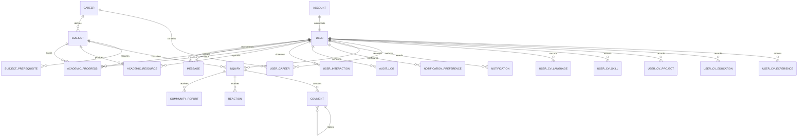
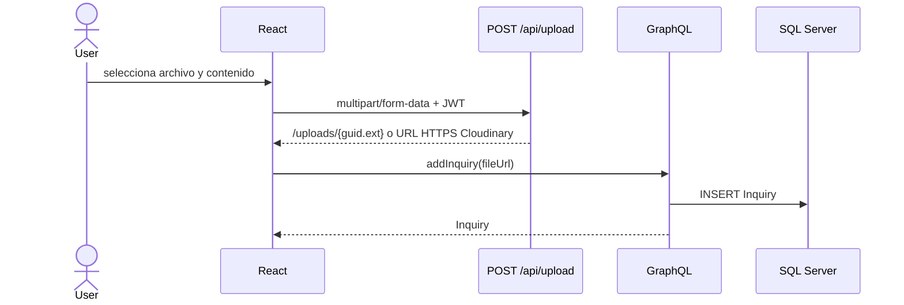

# Arquitectura y diseno de OneITB23

**Ultima alineacion con codigo**: 2026-07-07

## 1. Stack vigente

| Capa | Tecnologia |
|---|---|
| Backend | .NET 8 / ASP.NET Core |
| API de negocio | HotChocolate GraphQL 14.2.0 |
| Persistencia | Entity Framework Core 8.0.6 / SQL Server 2022 Docker local / Azure SQL Free Tier objetivo |
| Frontend Web | React 18 / Apollo Client 3.7 / Vite 8 |
| Frontend Mobile | React Native / Expo planificado; no existe codigo mobile versionado |
| UI | Tailwind CSS 4 / FontAwesome 6.6 |
| Tiempo real | GraphQL Subscriptions sobre WebSocket; Redis Pub/Sub opcional en produccion |
| Despliegue e Infra | Docker multi-stage / Nginx reverse proxy / Redis / Cloudinary opcional / GitHub Actions |

## 2. Estructura fisica

```text
API Graphql/
|-- Entities/     modelos de dominio
|-- Data/         DbContext, inicializacion y migraciones
|-- Services/     reglas de negocio y acceso a datos
`-- OneITB/       host ASP.NET Core, GraphQL y controladores REST

FrontEnd/OneItb-FE/src/
|-- Components/   vistas y componentes por dominio
|-- context/      autenticacion
|-- data/graphql/ operaciones Apollo
|-- hooks/        hooks compartidos
|-- router/       rutas publicas y privadas
`-- utils/        parsing y utilidades sin estado

Mobile/OneItb-App/
`-- planificado; no existe codigo versionado en el repositorio actual
```

## 3. Contratos de transporte

- `/graphql` por HTTP: queries y mutations de aplicacion.
- `/graphql` por WebSocket: mensajes privados y notificaciones academicas en tiempo real.
- `POST /api/upload`: transferencia binaria autenticada y desacoplada, maximo 15 MB.
- `/uploads/{file}`: lectura de archivos estaticos almacenados localmente cuando no se usa Cloudinary.

Los binarios no se envian mediante GraphQL. Primero se obtiene una URL desde `/api/upload`; luego esa URL se persiste en `Inquiry.FileUrl`, `Comment.FileUrl` o `AcademicResource.FileUrl`. El storage usa disco local por defecto y Cloudinary cuando `CloudinarySettings:Url` esta configurado.

Controles defensivos vigentes: `/graphql` y `/api/upload` tienen rate limiting fixed-window por IP; GraphQL aplica profundidad maxima configurable (`GraphQL:MaxExecutionDepth`, default 10) y limites globales de paginacion (`DefaultPageSize` 20, `MaxPageSize` 50). El login usa lockout persistente por cuenta (`FailedLoginAttempts`, `LockoutEnd`) para mitigar fuerza bruta aunque el atacante rote IPs.

## 4. Modelo de dominio actual



Entidades persistidas: `Account`, `User`, `Career`, `UserCareer`, `Subject`, `SubjectPrerequisite`, `Inquiry`, `Comment`, `Reaction`, `CommunityReport`, `UserInteraction`, `Message`, `AcademicResource`, `AcademicProgress`, `Notification`, `NotificationPreference`, `ModerationAudit`, `AuditLog`, `MagicLink`, `UserCvExperience`, `UserCvEducation`, `UserCvProject`, `UserCvSkill` y `UserCvLanguage`.

## 5. Integridad y borrado

- Las relaciones sociales, academicas, de publicaciones, comentarios y mensajes usan `DeleteBehavior.Restrict`.
- `Inquiry` y `Comment` usan soft-delete mediante `IsActive` y filtros globales.
- La relacion 1:1 `Account`-`User` conserva cascade como excepcion explicita del agregado de identidad.
- Todas las claves foraneas relevantes se modelan de forma explicita; no se admiten shadow properties.

## 6. Flujos principales

### Publicacion con archivo



### Comentario con archivo

El flujo reutiliza el mismo endpoint y finaliza con `addComment(inquiryId, content, parentCommentId, fileUrl)`. Las respuestas usan `ParentCommentId` y se limitan al mismo `Inquiry`.

### Mensajeria privada

El historial se persiste en `Messages`. El envio publica un evento al topico privado del receptor; Apollo reconcilia historial, eventos y estado optimista.

### Recursos y progreso academico

Los recursos academicos se consultan por materia mediante `academicResources(subjectId, searchTerm, category)` y el alias compatible `resourcesBySubject(subjectId, searchTerm, category)`. Los registros soportan categoria (`LIBRO`, `APUNTE`, `EXAMEN`, `OTRO`), versionado, enlaces externos o URLs de archivos ya subidos por `/api/upload`. Administradores, profesores y usuarios activos inscriptos en la carrera de la materia pueden cargar recursos; la lectura queda restringida por carrera salvo roles institucionales.

El progreso academico se persiste como un registro actual por estudiante y materia. Administradores y profesores asignan estado/nota mediante `upsertAcademicProgress`; el estudiante consulta solo su propio historial con `myAcademicProgress`, mientras que `academicProgressForUser` queda reservado a administradores.

### Adaptador SIU y notificaciones academicas

La integracion SIU usa un puerto `ISiuIntegrationService` para aislar la plataforma externa del dominio propio. La implementacion actual `MockSiuIntegrationService` devuelve calificaciones simuladas; `AcademicService.SyncSiuGradesAsync` consume esos registros y hace upsert idempotente en `AcademicProgress`, validando cuenta local, rol estudiante y pertenencia a la carrera de la materia. La mutacion `syncSiuGrades(subjectId)` esta restringida a administradores.

Las notificaciones se persisten en `Notifications` y las preferencias por tipo en `NotificationPreferences`. `NotificationService` aplica preferencias por defecto habilitadas, guarda eventos academicos y publica en el topico privado `notification:{userId}`. El cliente web consume `notificationReceived` con Apollo WebSocket y expone una campanita global con lectura y preferencias.

### Topologia productiva

`docker-compose.prod.yml` define SQL Server 2022, Redis 7, API .NET y frontend Nginx. Nginx sirve los estaticos de React con fallback SPA y proxyea `/graphql`, `/api` y `/uploads` a la API, preservando WebSockets para subscriptions. La API selecciona Redis Subscriptions cuando existe `ConnectionStrings:Redis`; sin esa variable conserva InMemory para desarrollo local.

### Audit Trail, constancias y credenciales publicas

La trazabilidad transversal usa `AuditSaveChangesInterceptor`, registrado en EF Core, para escribir `AuditLog` sobre cambios de `User`, `AcademicProgress`, `AcademicResource`, `Inquiry` y `Comment`. El log guarda actor autenticado cuando existe, correlation id, entidad, clave, accion y snapshots JSON acotados. La query `auditLogs(first, entityName, actorUserId)` esta restringida a administradores.

El modulo academico permite exportar el progreso propio como CSV e imprimir una constancia formal desde React sin agregar dependencias de PDF. Para credenciales compartibles, `publicCertificate(id)` devuelve solo progreso aprobado y activo; la ruta publica `/certificate/{id}` renderiza una tarjeta institucional con enlace de compartir en LinkedIn. Open Graph perfecto para crawlers queda condicionado a SSR o HTML renderizado desde backend.

## 7. Estado y limites conocidos

- Redis Pub/Sub y Cloudinary estan implementados como adaptadores condicionales. Para elevarlos a `[V]` se requiere smoke test con secretos productivos reales.
- La regresion autenticada en navegador del hub academico sigue pendiente para elevar recursos academicos de `[I]` a `[V]`.
- El runtime local canonico usa SQL Server 2022 en Docker con SQL Auth por `dotnet user-secrets`; LocalDB/SQLEXPRESS con Windows Auth queda descartado para validacion de specs.
- El seeding demo/productivo es idempotente y configurable. En produccion requiere `Seed:DemoPassword`/`ONEITB_SEED_DEMO_PASSWORD`; no resetea passwords existentes en reinicios.
- El cliente mobile React Native/Expo esta planificado, pero no existe codigo versionado; antes de implementarlo se debe definir queries/fragments compartidos con el cliente Web para no duplicar logica de Apollo Cache.
