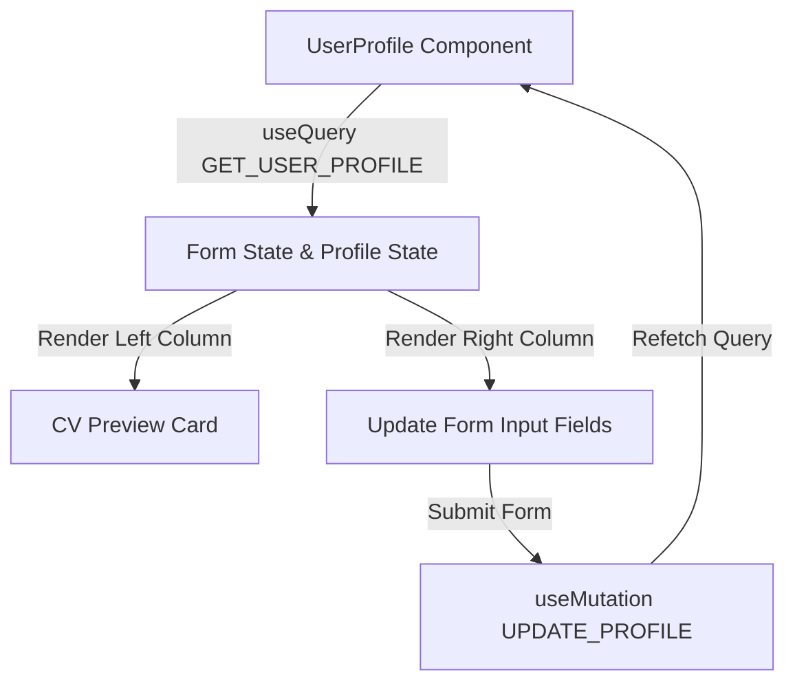

# Data Model Design: Router Fix & CV Layout (023)

## Entity Mapping
The entities remain unchanged from the backend GraphQL schema integration:
- `User`: Handles details (`biography`, `phone`, `linkedIn`, `facebook`, `instagram`).
- `UpdateProfileInput`: Input schema for updating profile details.

## UI Data Flow Diagram

